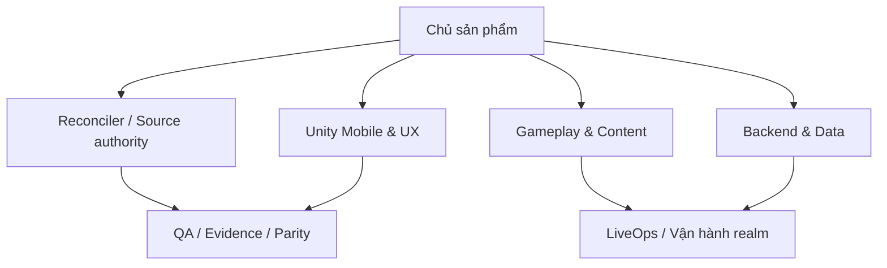

# Mô hình cơ cấu tổ chức

## Sơ đồ tổ chức

## Ý nghĩa các bộ phận

| **STT** | **Tên bộ phận** | **Mô tả** |
| --- | --- | --- |
| 1 | Chủ sản phẩm | Duyệt phạm vi, phase P0-P4 và tiêu chí phát hành. |
| 2 | Reconciler / Source authority | Khóa snapshot, package order, locale, hash; xử lý mâu thuẫn evidence. |
| 3 | Gameplay & Content | Đặc tả combat, skill, map, NPC, quest, item và social theo source. |
| 4 | Backend & Data | Sở hữu Go modular monolith, PostgreSQL, REST/WSS và transaction. |
| 5 | Unity Mobile & UX | Sở hữu client mobile, input, prediction, HUD/panel và asset. |
| 6 | QA / Evidence / Parity | Golden, replay, traceability, validator và sign-off parity. |
| 7 | LiveOps | Realm, release, backup/restore, quan sát và rollback. |
| 8 | Người chơi | Actor sử dụng sản phẩm; không có quyền quản trị nội dung/runtime. |

# Nhu cầu người dùng và Yêu cầu của phần mềm (NGHIỆP VỤ)

| **STT** | **Nhu cầu** | **Nghiệp vụ** | **Ai** |  |  |  | **Mức độ hỗ trợ** | **Phân loại yêu cầu** |
| --- | --- | --- | --- | --- | --- | --- | --- | --- |
|  |  |  | **Lãnh đạo** | **Bộ phận thực hành** | **Bộ phận liên quan** | **Hệ thống ngoài** |  |  |
| 1 | PO muốn có bằng chứng đối chiếu combat mobile với game PC trên bộ huấn luyện chuẩn | OBJ-P0-001: Chạy Combat Parity Lab với 5 NPC huấn luyện | PO | QA, Gameplay | Unity, Backend | Corpus PC | Bán tự động vì capture PC `BLOCKED` | Nghiệp vụ/P0 |
| 2 | Người chơi muốn tạo tài khoản để bắt đầu sử dụng trò chơi | FR-AUTH-001: Đăng ký qua REST |  | Người chơi | Backend | Email tùy chọn, OTP xác minh để reset | Tự động | Lưu trữ/P1 |
| 3 | Người chơi muốn truy cập và kết thúc phiên tài khoản an toàn | FR-AUTH-002: Login, refresh, logout |  | Người chơi | Backend | PostgreSQL | Tự động | Xử lý/P1 |
| 4 | Người chơi muốn tạo nhân vật với các lựa chọn khởi đầu | FR-CHAR-001: Chọn tên, giới tính, ngũ hành ban đầu |  | Người chơi | Backend, Content | PostgreSQL | Tự động | Lưu trữ/P1 |
| 5 | Người chơi muốn có thể khôi phục nhân vật trong thời hạn cho phép nếu xóa nhầm | FR-CHAR-002: Soft-delete, restore theo cửa sổ |  | Người chơi | Backend | PostgreSQL | Tự động | An toàn/P1 |
| 6 | Người chơi muốn vào realm và tiếp tục phiên chơi bị gián đoạn | FR-SESS-001: Bootstrap, WSS hello/resume |  | Người chơi | Backend | WSS | Tự động | Xử lý/P1 |
| 7 | Người chơi muốn vào Ba Lăng map 53 đúng vị trí khởi đầu | FR-WORLD-001: Nạp content/map và spawn |  | Người chơi | Content, Backend | Content bundle | Tự động | Nghiệp vụ/P1 |
| 8 | Người chơi muốn điều khiển nhân vật di chuyển thuận tiện bằng cảm ứng | FR-MOVE-001: Joystick là direct movement; auto-path chỉ từ quest/minimap/trạm |  | Người chơi | Unity, Backend | WSS | Tự động | Xử lý/P1 |
| 9 | Người chơi muốn chuyển vùng hoặc kênh mà không mất phiên và liên kết tổ đội | FR-MOVE-002: Transfer giữ session và party affinity |  | Người chơi | Backend | WSS/PostgreSQL | Tự động | Xử lý/P2 |
| 10 | Người chơi muốn tấn công đúng mục tiêu trên màn hình mobile mà không phải chạm actor nhỏ | FR-TGT-001: Tap attack/skill tự chọn; giữ-kéo chọn theo hướng, không tap actor nhỏ |  | Người chơi | Unity, Gameplay | WSS | Tự động | Xử lý/P0 |
| 11 | Người chơi muốn khóa mục tiêu chiến đấu và tránh truy đuổi vượt phạm vi | FR-TGT-002: Khóa/mở khóa và hard leash |  | Người chơi | Unity, Backend | WSS | Tự động | Xử lý/P0 |
| 12 | Người chơi muốn kết quả tung chiêu được máy chủ quyết định nhất quán | FR-CBT-001: Gửi cast intent; server tick 18 Hz quyết định |  | Người chơi | Backend, Gameplay | WSS | Tự động | Tính toán/P0 |
| 13 | PO muốn combat có thể tái phát cùng một kết quả để kiểm chứng parity | FR-CBT-002: Integer/fixed-point và RNG seed tái phát | PO | Gameplay, QA | Backend | Golden corpus | Tự động | Chất lượng/P0 |
| 14 | Người chơi muốn ngắm hướng hoặc vùng tác dụng chính xác bằng thao tác mobile | FR-CBT-003: Preview hướng/vùng, release để cast |  | Người chơi | Unity | WSS | Tự động | Tiện dụng/P0 |
| 15 | Người chơi muốn ý định tung chiêu mới nhất được ưu tiên khi mạng hoặc nhịp gửi chưa sẵn sàng | FR-CBT-004: Chỉ giữ intent chưa gửi mới nhất |  | Người chơi | Unity, Backend | WSS | Tự động | Hiệu quả/P0 |
| 16 | Người chơi muốn sử dụng đầy đủ các kỹ năng dùng chung của nhân vật | FR-SKL-001: Đánh thường, khinh công/di chuyển, hồi thành theo catalog |  | Người chơi | Gameplay, Content | Manifest skill | Tự động | Nghiệp vụ/P0 |
| 17 | Người chơi muốn học và nâng các kỹ năng nhập môn theo tiến trình | FR-SKL-002: Catalog novice và tiến trình học/nâng |  | Người chơi | Gameplay, Content | Manifest skill | Tự động | Nghiệp vụ/P0 |
| 18 | Người chơi muốn trải nghiệm bộ kỹ năng của đủ 10 môn phái như game PC | FR-SKL-003: Thiếu Lâm, Thiên Vương, Đường Môn, Ngũ Độc, Nga Mi, Thúy Yên, Cái Bang, Thiên Nhẫn, Võ Đang, Côn Lôn |  | Người chơi | Gameplay, QA | Corpus PC | Bán tự động; logic cần golden | Nghiệp vụ/P0-P4 |
| 19 | Người chơi muốn phát triển nhân vật từ cấp 1 đến 200 và phân bổ điểm nhận được | FR-PROG-001: Nhận EXP, lên cấp, điểm thuộc tính/kỹ năng |  | Người chơi | Backend, Gameplay | PostgreSQL | Tự động | Tính toán/P1 |
| 20 | Người chơi muốn gia nhập hoặc rời môn phái theo điều kiện của trò chơi | FR-PROG-002: Đổi trạng thái môn phái theo rule content |  | Người chơi | Gameplay | Lua sandbox | Tự động | Xử lý/P2 |
| 21 | Người chơi muốn nhặt chiến lợi phẩm được phép nhận vào hành trang | FR-ITEM-001: Server cấp quyền và tạo item instance |  | Người chơi | Backend, Gameplay | WSS/PostgreSQL | Tự động | Lưu trữ/P1 |
| 22 | Người chơi muốn quản lý tối đa 60 vật phẩm theo mô hình mỗi vật phẩm một ô | FR-INV-001: Mỗi item chiếm đúng một ô, không drag/drop |  | Người chơi | Unity, Backend | PostgreSQL | Tự động | Lưu trữ/P1 |
| 23 | Người chơi muốn dùng hoặc hủy vật phẩm thuận tiện và không bị thực hiện lặp | FR-INV-002: Tap + action sheet, idempotency key |  | Người chơi | Backend | PostgreSQL | Tự động | Xử lý/P1 |
| 24 | Người chơi muốn mặc hoặc tháo trang bị đúng ô và điều kiện sử dụng | FR-EQP-001: Kiểm tra slot/điều kiện rồi commit |  | Người chơi | Backend, Gameplay | PostgreSQL | Tự động | Tính toán/P1 |
| 25 | Người chơi muốn chiến lợi phẩm chỉ thuộc về người hoặc tổ đội có quyền trong thời hạn quy định | FR-LOOT-001: Resolve owner/party và expiry |  | Người chơi | Backend | WSS | Tự động | Quy định/P1 |
| 26 | Người chơi muốn tương tác với NPC để hội thoại và chọn nghiệp vụ | FR-NPC-001: Target, mở thoại/menu, chọn action |  | Người chơi | Gameplay | Lua 5.1 sandbox | Tự động | Xử lý/P1 |
| 27 | Người chơi muốn nhận, theo dõi và hoàn thành nhiệm vụ để nhận thưởng | FR-QST-001: State machine quest và reward transaction |  | Người chơi | Gameplay, Backend | Lua/PostgreSQL | Tự động | Xử lý/P1-P2 |
| 28 | Người chơi muốn nhân vật tự tìm đến NPC hoặc điểm bản đồ và dừng đúng vị trí | FR-PATH-001: Tính đường tới NPC/map point và dừng đúng bán kính |  | Người chơi | Unity, Gameplay | Nav/content | Tự động | Tính toán/P2 |
| 29 | Người chơi muốn tự động chiến đấu và nhặt đồ trong phạm vi kiểm soát | FR-AUTO-001: Chọn mục tiêu, skill, loot trong hard leash |  | Người chơi | Unity, Backend | WSS | Tự động | Xử lý/P1 |
| 30 | Người chơi muốn nhân vật tự dùng hồi phục theo ngưỡng HP/MP đã chọn | FR-AUTO-002: Ngưỡng HP/MP theo cấu hình người chơi |  | Người chơi | Unity, Backend | WSS | Tự động | Xử lý/P2 |
| 31 | Người chơi muốn trang bị và sử dụng thú cưỡi để thay đổi tốc độ di chuyển | FR-MNT-001: Trang bị, cưỡi/xuống và modifier tốc độ |  | Người chơi | Gameplay | Content | Tự động | Xử lý/P2 |
| 32 | Người chơi muốn triệu hồi và phát triển đồng hành đi theo nhân vật | FR-PET-001: Triệu hồi, theo chủ, skill/persistence |  | Người chơi | Gameplay, Backend | Content/PostgreSQL | Tự động | Xử lý/P3 |
| 33 | Người chơi muốn trò chuyện với đúng cộng đồng theo từng kênh | FR-CHAT-001: Kênh gần/đội/bang/thế giới |  | Người chơi | Backend | WSS | Tự động | Xử lý/P3 |
| 34 | Người chơi muốn lập và quản lý tổ đội với người chơi khác | FR-TEAM-001: Tạo, mời, trả lời, rời, đội trưởng |  | Người chơi | Backend | WSS | Tự động | Xử lý/P2 |
| 35 | Người chơi muốn giao dịch vật phẩm trực tiếp với người khác mà không mất hoặc nhân đôi tài sản | FR-TRD-001: Offer, lock, confirm đôi và commit atomically |  | Người chơi | Backend | PostgreSQL | Tự động | Lưu trữ/P3 |
| 36 | Người chơi muốn mua hoặc bán vật phẩm với NPC theo giá và điều kiện hợp lệ | FR-SHOP-001: Kiểm giá, tiền, chỗ trống rồi commit |  | Người chơi | Backend, Gameplay | PostgreSQL | Tự động | Tính toán/P1 |
| 37 | Người chơi muốn tạo, tham gia và quản lý thành viên bang hội theo quyền | FR-GUILD-001: Tạo/gia nhập/rời, cấp bậc và quyền |  | Người chơi | Backend | PostgreSQL | Tự động | Xử lý/P3 |
| 38 | Người chơi muốn đổi trạng thái PK theo quy tắc của bản đồ và quan hệ xã hội | FR-PVP-001: Áp dụng cooldown, đội/bang và map rule |  | Người chơi | Backend, Gameplay | WSS | Tự động | Quy định/P4 |
| 39 | PO và người chơi muốn tham gia đấu trường hoặc Tống Kim với điểm, thưởng và xếp hạng rõ ràng | FR-PVP-002: Match/event, điểm, thưởng, leaderboard | PO | Người chơi, LiveOps | Backend | PostgreSQL | Tự động | Báo biểu/P4 |
| 40 | PO và người chơi muốn có hoạt động endgame định kỳ để tiếp tục tranh tài | FR-END-001: Boss, ladder, event định kỳ theo catalog | PO | Người chơi, LiveOps | Gameplay | Lua/content | Bán tự động | Nghiệp vụ/P4 |
| 41 | PO muốn combat thời gian thực đáp ứng ổn định ở tải mục tiêu | NFR-PERF-001: 1.000 CCU, RTT 100 ms, p95 authoritative <=200 ms | PO | Backend, QA | LiveOps | Load harness | Tự động | Hiệu quả |
| 42 | PO muốn trò chơi vận hành mượt trên thiết bị Android 4 GB | NFR-MOB-001: >=30 FPS; tier trung-cao hướng 60 FPS | PO | Unity, QA |  | Thiết bị Android | Bán tự động | Hiệu quả |
| 43 | PO muốn tài sản kinh tế của người chơi không bị mất khi giao dịch được xác nhận | NFR-REL-001: ACK business sau PostgreSQL commit | PO | Backend, QA | LiveOps | PostgreSQL | Tự động | An toàn |
| 44 | REC muốn mọi content phát hành có thể truy nguyên nguồn, phiên bản và không tạo hai nguồn gameplay authority | NFR-CONT-001: Pin version/hash/locale/nguồn; config gameplay authoritative ở Go, Unity chỉ nhận projection presentation/prediction; production không hot-reload | REC | Content | Backend, Unity, QA | MinIO | Tự động | Tương thích |
| 45 | PO muốn chỉ công bố parity khi có bằng chứng golden và người duyệt xác nhận | NFR-PAR-001: Logic 100%; frame SSIM >=0,99/case và reviewer ký | PO | QA | Gameplay, Unity | PC runtime | Bán tự động; runtime `BLOCKED` | An toàn |
| 46 | PO muốn HUD hiện hữu được bảo toàn khi thích nghi Safe Area trên mobile | FR-UI-HUD-001: Giữ nguyên geometry HUD `1280x720`; Safe Area chỉ transform toàn HUD root | PO | Unity, QA | Gameplay | HUD golden | Tự động; golden `BLOCKED` | Tương thích/P0 |
| 47 | PO muốn các panel stale được thay mới bằng UX mobile không kéo thả | FR-UI-PANEL-001: Primary panel + bottom sheet, dữ liệu revisioned, không drag/drop | PO | Unity | Backend, QA | WSS/REST | Tự động | Xử lý/P1 |
| 48 | REC muốn panel mobile giữ visual PC mới nhất và hiển thị tiếng Việt | FR-UI-SPR-001: Ưu tiên SPR Việt; nếu chỉ có baked Chinese thì giữ chrome/frame PC, render text Việt runtime và ghi debt | REC | Content, Unity | QA | vltktool/PAK | Bán tự động; catalog `BLOCKED` | Tương thích/P0 |

# Ma trận kết quả mong muốn theo actor

| Actor | Kết quả mong muốn | Nhu cầu/liên kết | Bằng chứng nghiệm thu |
| --- | --- | --- | --- |
| Người chơi | Vào game, điều khiển, combat và phát triển nhân vật trên mobile mà không cần chạm actor nhỏ hoặc kéo thả | FR-AUTH-001, FR-SESS-001, FR-MOVE-001, FR-TGT-001, FR-INV-001 | TEST-ACS-001, TEST-TGT-001, TEST-IIEL-001 |
| PO | Có vertical slice P0/P1 tái lập để quyết định mở wave tiếp theo | OBJ-P0-001, OBJ-P1-001 | TEST-CBT-003, TEST-RELEASE-001 |
| Gameplay | Logic 18 Hz, formula/RNG, target và skill không có authority thứ hai ở client | FR-CBT-001, FR-CBT-002, FR-SKL-003 | TEST-CBT-002, TEST-SKL-002, TEST-SKL-003 |
| Unity Mobile & UX | HUD hiện hữu bất biến, panel v2 thao tác một tay, SPR PC Việt được tái sử dụng | FR-UI-HUD-001, FR-UI-PANEL-001, FR-UI-SPR-001 | TEST-HUD-001, TEST-UI-002, TEST-UI-007 |
| Backend Go | Auth/bootstrap, WSS, inventory/economy và checkpoint commit đúng transaction | FR-AUTH-002, FR-SESS-001, FR-INV-002, NFR-REL-001 | TEST-CONTRACT-001, TEST-ECON-001, TEST-CHECKPOINT-001 |
| Content/Resolver | Mỗi catalog row có source path/hash/locale/package provenance hoặc được BLOCKED có owner | NFR-CONT-001, FR-SKL-003 | TEST-SOURCE-001, TEST-CATALOG-001, TEST-COVERAGE-001 |
| QA / Evidence / Parity | Không promotion PARITY_DONE khi thiếu golden, test PASS và reviewer sign-off | NFR-PAR-001 | TEST-SKL-003, TEST-UI-007, GATE-G3 |
| Reconciler | Snapshot, contradiction và phase dependency được khóa trước khi mở wave | OBJ-007, MIG-001 | TEST-SOURCE-001, GATE-G0, GATE-G1 |
| LiveOps/SRE | Realm, release, backup/restore, drain và rollback quan sát được mà không sửa DB trực tiếp | NFR-REL-001, OBJ-006 | TEST-RESTORE-001, TEST-RELEASE-001, GATE-G6 |

# Biểu mẫu

## BM01: Phiếu tạo nhân vật và bootstrap

Trường: `request_id`, `realm_id`, tên, giới tính, lựa chọn ban đầu, `content_version`; kết quả gồm `character_id`, spawn map/tọa độ và snapshot revision.

## BM02: Combat intent và combat result

Intent: `command_id`, tick client, actor, target/aim, skill, sequence. Result: tick server, accepted/rejected + error ID, damage/state/loot delta, RNG audit token. Transport ACK không phải business success.

## BM03: Phiếu mutation economy

Trường: `idempotency_key`, actor, operation, item instance/slot/quantity/money, expected revision; kết quả chỉ thành công sau commit PostgreSQL.

# Quy định

| **Tên quy định** | **Nội dung** |
| --- | --- |
| QD-CBT-001 | Combat production server-authoritative 18 Hz; client chỉ prediction/presentation. |
| QD-CBT-002 | Tính toán parity dùng integer/fixed-point và deterministic RNG; sai khác chưa có golden là `BLOCKED`. |
| QD-TGT-001 | Không tap actor nhỏ; tap attack/skill tự chọn, giữ-kéo chọn theo hướng, target lock và một pending cast mới nhất; auto-combat không vượt hard leash. |
| QD-INV-001 | Túi authoritative 60 ô, mỗi item một ô, không drag/drop; combat khóa mutation item. |
| QD-ECO-001 | Economy idempotent; business ACK chỉ phát sau PostgreSQL commit. |
| QD-CONT-001 | Bundle pin `content_version`, source hash, locale, provenance; production không hot-reload. |
| QD-LUA-001 | Quest/event legacy chạy Lua 5.1 sandbox, chỉ host API whitelist. |
| QD-PAR-001 | Static evidence tối đa `SPECIFIED/FUNCTIONAL`; `PARITY_DONE` cần runtime golden + reviewer. |
| QD-SCOPE-001 | Không port PaySys, launcher/patcher riêng, GM/backoffice, anti-cheat PC; mock chỉ DevHarness. |
| QD-MAP-001 | Ba Lăng canonical luôn là mapId 53; đường remap/hard-code 79 là gap phải loại khỏi production. |

# Danh sách yêu cầu

## Danh sách yêu cầu nghiệp vụ

| **Danh sách yêu cầu nghiệp vụ**
**Bộ phận: Gameplay, Backend, Unity, QA** |  |  |  |  |  |
| --- | --- | --- | --- | --- | --- |
| **STT** | **Nghiệp vụ** | **Mô tả tóm tắt** | **Biểu mẫu** | **Quy định** | **Ghi chú** |
| 1 | OBJ-P0-001 Combat Parity Lab | 5 NPC, 242-row shared/novice/10-phái union, replay xác định | BM02 | QD-CBT-001/002, QD-PAR-001 | P0; golden runtime `BLOCKED` |
| 2 | OBJ-P1-001 Vertical slice | Login -> tạo nhân vật -> map 53 -> combat -> loot -> túi/mặc -> cấp 200 -> lưu | BM01-03 | QD-INV-001, QD-ECO-001 | P1 |
| 3 | OBJ-P2-001 World PvE | Nhiều map, NPC/quest, tự tìm đường, tổ đội, thú cưỡi | BM02 | QD-CONT-001, QD-LUA-001 | P2 catalog |
| 4 | OBJ-P3-001 Social/economy | Chat, trade, guild, pet, shop/economy | BM03 | QD-ECO-001 | P3 catalog |
| 5 | OBJ-P4-001 PvP/endgame | PK, event, ladder, boss/endgame | BM02-03 | QD-PAR-001 | P4 catalog |

## Danh sách yêu cầu tiến hóa

| **Danh sách yêu cầu tiến hóa** |  |  |  |
| --- | --- | --- | --- |
| **STT** | **Nghiệp vụ** | **Tham số cần thay đổi** | **Miền giá trị cần thay đổi** |
| 1 | FR-SKL-003 Catalog skill | Skill/level/branch/effect content | Theo manifest đã pin; không sửa code protocol |
| 2 | FR-QST-001 Quest/event | Lua + content version | Script sandbox đã ký/hash |
| 3 | FR-PVP-002 Event | Lịch, map, reward | Cấu hình LiveOps được duyệt |
| 4 | NFR-CONT-001 Bundle | Version/locale/source hash + 242-row union digest + runtime skill policy | Immutable trong một release; exact digest negotiation |

## Danh sách yêu cầu hiệu quả

| **Danh sách yêu cầu hiệu quả** |  |  |  |  |
| --- | --- | --- | --- | --- |
| **STT** | **Nghiệp vụ** | **Tốc độ xử lí** | **Dung lượng lưu trữ** | **Ghi chú** |
| 1 | NFR-PERF-001 Realtime | p95 <=200 ms tại RTT 100 ms | Test evidence giữ theo release và log kỹ thuật 14 ngày | 1.000 WSS CCU |
| 2 | Combat tick | 18 tick/s ổn định | Replay theo test run | Không dùng float gameplay |
| 3 | AOI | 64 actor + 128 entity nhẹ | Snapshot/delta bounded | Gate tải |
| 4 | Bootstrap | p95 <=500 ms không tính tải content | Snapshot nhân vật bounded | Đo tại pre-prod ephemeral |
| 5 | Economy commit | Không ACK trước commit | Audit append-only | Crash test bắt buộc |
| 6 | Android thấp | >=30 FPS | Working set mục tiêu <=1,5 GB | Thiết bị 4 GB |
| 7 | Android trung-cao | Mục tiêu 60 FPS | Asset tiered | Không phải release gate thấp |
| 8 | Reconnect | Resume không nhân đôi command | Command window bounded | Grace 15 giây; avatar vẫn ở world và có thể bị đánh |
| 9 | Content load | Không hot-reload production | Bundle immutable | Pin hash |
| 10 | Golden visual | SSIM >=0,99 từng case | MinIO SHA-256 | Runtime capture `BLOCKED` |

## Danh sách yêu cầu tiện dụng

| **Danh sách yêu cầu tiện dụng** |  |  |  |  |
| --- | --- | --- | --- | --- |
| **STT** | **Nghiệp vụ** | **Mức độ dễ học** | **Mức độ dễ sử dụng** | **Ghi chú** |
| 1 | Di chuyển | Tutorial ngắn | Joystick trực tiếp; auto-path từ quest/minimap/trạm | Mobile |
| 2 | Chọn mục tiêu | Không cần tap actor nhỏ | Tap attack/skill tự chọn + giữ-kéo hướng + lock | Policy duy nhất |
| 3 | Aim skill | Overlay hướng/vùng | Giữ-kéo-thả | Hủy bằng kéo ra |
| 4 | Cast nhanh | Một lần tap | Pending mới nhất | Feedback reject |
| 5 | Túi | Action sheet | Không drag/drop | 60 ô |
| 6 | Trang bị | Tap mặc/tháo | Hiện điều kiện thiếu | Combat lock rõ |
| 7 | Quest | Theo dõi mục tiêu | Tap auto-path | P2 |
| 8 | Auto-combat | Preset đơn giản | Hiện leash/target | Dừng khẩn cấp |
| 9 | Panel | Primary screen + bottom sheet | Back nhất quán | Feature flag |
| 10 | HUD | Giữ geometry 1280x720 | Scale/crop có debt | Ưu tiên SPR Việt |
| 11 | Reconnect | Thông báo trạng thái | Tự resume | Không che lỗi business |

## Danh sách yêu cầu bảo mật

| **Danh sách yêu cầu bảo mật** |  |  |  |  |
| --- | --- | --- | --- | --- |
| **STT** | **Nghiệp vụ \ Nhóm người dùng** | **Người chơi** | **LiveOps** | **Dịch vụ** |
| 1 | Đăng ký/login | Add/View tự thân | Không xem mật khẩu | Admin token rotation |
| 2 | Nhân vật | CRUD tự thân | Restore có audit | Authorize account ownership |
| 3 | Combat | Gửi intent | Quan sát | Validate tick/actor/target |
| 4 | Inventory/economy | Mutation tự thân | Audit, không sửa trực tiếp | Transaction + idempotency |
| 5 | Quest/Lua | Chọn action | Deploy script đã duyệt | Sandbox whitelist |
| 6 | Chat/social | Gửi/xem theo kênh | Rate-limit, mute/block, từ cấm và report giữ evidence 30 ngày | Membership check |
| 7 | Guild | Theo role | Audit | RBAC guild |
| 8 | Content | View | Promote release | Verify hash/signature |
| 9 | Backup | Không | Trigger theo runbook | Encrypted credential |
| 10 | Validator/release | Không | Xem kết quả | Release gate signed |

## Danh sách yêu cầu an toàn

| **Danh sách yêu cầu an toàn** |  |  |  |
| --- | --- | --- | --- |
| **STT** | **Nghiệp vụ** | **Đối tượng** | **Ghi chú** |
| 1 | Idempotency | Economy/quest reward | Retry không nhân đôi |
| 2 | Resume | Session/command | Không rollback state committed |
| 3 | Backup/restore | PostgreSQL | Migration/restore test bắt buộc |
| 4 | Release rollback | Binary/schema/content | Tương thích ngược theo plan |
| 5 | Combat replay | Tick/RNG/state | Phát hiện divergence |
| 6 | Lua sandbox | Host/runtime | Chặn filesystem/network API |

## Danh sách yêu cầu tương thích

| **Danh sách yêu cầu tương thích** |  |  |  |
| --- | --- | --- | --- |
| **STT** | **Nghiệp vụ** | **Đối tượng** | **Ghi chú** |
| 1 | Visual/content | Active Vietnamese client manifest | Chrome PC + text Việt khi asset Trung |
| 2 | Protocol realtime | Protobuf `game.v1` | Breaking/golden/fuzz test |
| 3 | REST | OpenAPI | Auth/bootstrap/character |
| 4 | Thiết bị | Android 4 GB | >=30 FPS |
| 5 | Legacy behavior | Source server + runtime golden | Runtime golden `BLOCKED` |

## Danh sách yêu cầu công nghệ

| **Danh sách yêu cầu công nghệ** |  |  |  |
| --- | --- | --- | --- |
| **STT** | **Yêu cầu** | **Mô tả chi tiết** | **Ghi chú** |
| 1 | Backend | Go 1.26 modular monolith, một process/realm | Target architecture |
| 2 | Dữ liệu | PostgreSQL 16 duy nhất cho production | Không migrate mock/local |
| 3 | Transport | REST auth/bootstrap/character; WSS Protobuf realtime | ACK != business success |
| 4 | Client | Unity mobile; mock/catalog C# chỉ DevHarness | Production không fallback |

# Bảng trách nhiệm

## Bảng trách nhiệm yêu cầu nghiệp vụ

| **Bảng trách nhiệm**
**Bộ phận: Gameplay/Backend/Unity/QA** |  |  |  |  |
| --- | --- | --- | --- | --- |
| **STT** | **Nghiệp vụ** | **Người dùng** | **Phần mềm** | **Ghi chú** |
| 1 | Auth/session | Cung cấp credential/realm | Xác thực, bootstrap, resume | Backend DRI |
| 2 | Character | Chọn thông tin hợp lệ | Validate, lưu, spawn | Backend DRI |
| 3 | World/movement | Gửi input | Validate barrier/AOI, reconcile | Shared DRI |
| 4 | Combat/target | Chọn target/skill/aim | 18 Hz authoritative, phát event | Gameplay DRI |
| 5 | Skills | Học/nâng/cast | Resolve catalog/effect/persist | Gameplay DRI |
| 6 | Progression | Chơi/nhận thưởng | EXP/level/point atomically | Backend DRI |
| 7 | Item/equipment | Chọn action | Validate slot/rule và commit | Backend DRI |
| 8 | NPC/quest/auto | Chọn tương tác/preset | Lua sandbox/state/leash | Gameplay DRI |
| 9 | Social/PvP/endgame | Tạo/mời/chọn mode | Membership/rule/reward | P2-P4 |

## Bảng trách nhiệm yêu cầu tiến hóa

| **Bảng trách nhiệm yêu cầu tiến hóa** |  |  |  |  |
| --- | --- | --- | --- | --- |
| **STT** | **Nghiệp vụ** | **Người dùng** | **Phần mềm** | **Ghi chú** |
| 1 | Content release | Chọn release đã duyệt | Verify exact digest/version/hash/locale/policy | Reconciler duyệt; `vltktool`, không filesystem fallback |
| 2 | Skill/quest wave | Không cần cập nhật app nếu contract giữ nguyên | Nạp bundle immutable | P2-P4 |
| 3 | Schema migration | Không thao tác | Expand/migrate/contract + rollback | Test restore |
| 4 | Protocol evolution | Cập nhật client tương thích | Version envelope | Breaking gate |

## Bảng trách nhiệm yêu cầu hiệu quả

| **Bảng trách nhiệm yêu cầu hiệu quả** |  |  |  |  |
| --- | --- | --- | --- | --- |
| **STT** | **Nghiệp vụ** | **Người dùng** | **Phần mềm** | **Ghi chú** |
| 1 | Combat | Mạng RTT 100 ms test | p95 <=200 ms | NFR-PERF-001 |
| 2 | AOI | Không | 64+128 entity | Load gate |
| 3 | Android | Chọn quality tier | >=30 FPS trên 4 GB | NFR-MOB-001 |
| 4 | Economy | Có thể retry | Idempotent/commit-before-ACK | Crash gate |
| 5 | Resume | Chờ reconnect | Khử trùng command | Reconnect gate |
| 6 | Content | Không | Cache bundle pinned theo exact digest | No hot reload; mismatch bootstrap lại |
| 7 | DB | Không | Index/transaction/realm isolation theo pha 3 | PostgreSQL role riêng, cấm client truy cập trực tiếp |
| 8 | Lua | Chọn action | Budget instruction/time/memory | Mặc định 100.000 instruction, 5 ms và 8 MB mỗi invocation; fail closed |
| 9 | Golden | Cung cấp capture khi có | SHA/SSIM/replay | `BLOCKED` runtime |
| 10 | Release | Không | Validator premerge/release | Ba mode |
| 11 | Telemetry | Cho phép technical telemetry tối thiểu; analytics sản phẩm opt-in | Metric không PII/secret | Metrics 30 ngày, log kỹ thuật 14 ngày |

## Bảng trách nhiệm yêu cầu tiện dụng

| **Bảng trách nhiệm yêu cầu tiện dụng** |  |  |  |  |
| --- | --- | --- | --- | --- |
| **STT** | **Nghiệp vụ** | **Người dùng** | **Phần mềm** | **Ghi chú** |
| 1 | Move | Joystick | Prediction/reconcile; auto-path là flow riêng | Mobile |
| 2 | Target | Tap attack/skill hoặc giữ-kéo hướng | Auto-acquire/lock/feedback | P0; không tap actor nhỏ |
| 3 | Aim | Giữ-kéo-thả | Preview/hủy | P0 |
| 4 | Cast | Tap skill | Latest pending | P0 |
| 5 | Túi | Tap item | Bottom sheet | No drag |
| 6 | Equip | Chọn mặc/tháo | Báo điều kiện/lock | P1 |
| 7 | Quest | Tap nút Tìm đường trên thẻ quest | Auto-path | P2; không tap actor hoặc đất trong world |
| 8 | Auto | Chọn preset/leash | Hiển thị trạng thái | P1-P2 |
| 9 | Social | Chọn actor/action | Context sheet | P2-P3 |
| 10 | HUD | Học geometry PC | Responsive safe area | 1280x720 baseline |
| 11 | Error | Đọc thông báo | Error ID + hành động phục hồi | Không che lỗi |

## Bảng trách nhiệm yêu cầu bảo mật

| **Bảng trách nhiệm yêu cầu bảo mật** |  |  |  |  |
| --- | --- | --- | --- | --- |
| **STT** | **Nghiệp vụ** | **Người dùng** | **Phần mềm** | **Ghi chú** |
| 1 | Auth | Bảo vệ credential | Hash/token rotation/rate limit | Chi tiết pha sau |
| 2 | Authoritative command | Không giả actor | Authorize session/character | Server quyết định |
| 3 | Economy/Lua | Không sửa client state | Transaction + sandbox | Audit |

## Bảng trách nhiệm yêu cầu an toàn

| **Bảng trách nhiệm yêu cầu an toàn** |  |  |  |  |
| --- | --- | --- | --- | --- |
| **STT** | **Nghiệp vụ** | **Người dùng** | **Phần mềm** | **Ghi chú** |
| 1 | Retry | Dùng cùng idempotency key | Trả cùng kết quả | Economy |
| 2 | Crash | Không thao tác | Recovery không double reward | PostgreSQL |
| 3 | Backup | Không | Backup + restore drill | BLOCKED [CẦN XÁC NHẬN] Owner: SRE; gỡ block khi PO/SRE duyệt lịch backup, retention và restore drill. |
| 4 | Migration | Không | Verify + rollback | Release gate |
| 5 | Reconnect | Chờ resume | Snapshot/revision reconcile | WSS |
| 6 | Parity | Không công bố sai | Chặn `PARITY_DONE` thiếu golden | QD-PAR-001 |

## Bảng trách nhiệm yêu cầu tương thích

| **Bảng trách nhiệm yêu cầu tương thích** |  |  |  |  |
| --- | --- | --- | --- | --- |
| **STT** | **Nghiệp vụ** | **Người dùng** | **Phần mềm** | **Ghi chú** |
| 1 | Android | Cập nhật bản hỗ trợ | Quality tier | BLOCKED [CẦN XÁC NHẬN] Owner: Mobile QA; gỡ block khi device matrix P0/P1 được duyệt và lưu trong test manifest. |
| 2 | Content PC | Không | Resolve/hash/locale | vltktool revision phải pin |
| 3 | Protobuf | Cập nhật trong window | Giữ envelope version | Golden/breaking |
| 4 | PostgreSQL | Không | Migration tương thích | V16 |
| 5 | Lua | Không | Lua 5.1 whitelist | Legacy scripts |

# Bảng mô tả chi tiết yêu cầu nghiệp vụ

## OBJ-P1-001: Chơi vertical slice và lưu tiến trình

| **TÊN NGHIỆP VỤ**
Tên người dùng sử dụng để gọi nghiệp vụ đó trong thực tế (ví dụ: *Đăng ký thẻ thành viên*). | Chơi VLTK từ đăng nhập đến persistence cấp 1-200 |
| --- | --- |
| **Người dùng** | Người chơi; Backend, Unity, Gameplay và QA phối hợp cung cấp |
| **Thời gian liên quan** | P1; mỗi phiên chơi và khi checkpoint/logout/disconnect |
| **Không gian liên quan** | Mobile Android, realm production; Ba Lăng map 53. Map remap 79 còn `BLOCKED`. |
| **Nghiệp vụ liên quan** | FR-AUTH-002, FR-CHAR-001, FR-SESS-001, FR-WORLD-001, FR-CBT-001, FR-ITEM-001, FR-INV-001, FR-EQP-001, FR-PROG-001 |
| **Mô tả bước tiến hành** | B1: REST login/refresh, chọn realm. B2: tạo/chọn nhân vật và bootstrap content version. B3: mở WSS hello/resume, nhận snapshot revision. B4: spawn map 53, di chuyển và chọn NPC. B5: cast qua server tick 18 Hz, nhận combat event. B6: server resolve loot, người chơi nhặt vào một trong 60 ô. B7: tap item để mặc; server validate rồi commit. B8: nhận EXP/lên cấp/điểm đến 200 theo content. B9: checkpoint/logout; reconnect phải khôi phục base, item, skill và task. Tiêu chí: replay deterministic; không double reward; state sau reconnect bằng state committed. |

## OBJ-P0-001: Chạy Combat Parity Lab

| **TÊN NGHIỆP VỤ**
Tên người dùng sử dụng để gọi nghiệp vụ đó trong thực tế (ví dụ: *Đăng ký thẻ thành viên*). | So khớp combat PC trên 5 NPC huấn luyện |
| --- | --- |
| **Người dùng** | QA parity, Gameplay, Unity; PO/reviewer duyệt |
| **Thời gian liên quan** | P0 và regression mỗi release content/combat |
| **Không gian liên quan** | Realm lab cô lập, deterministic seed; PC runtime capture hiện `BLOCKED` |
| **Nghiệp vụ liên quan** | FR-TGT-001/002, FR-CBT-001..004, FR-SKL-001..003, NFR-PAR-001 |
| **Mô tả bước tiến hành** | B1: khóa source/content/hash/locale và case. B2: spawn actor + 5 NPC với state chuẩn. B3: chạy shared, novice và toàn bộ 242-row shared/novice/10-phái union bằng input/tick/seed cố định. B4: thu event, state, damage, missile và frame sequence. B5: so logic 100%, visual SSIM >=0,99 từng case. B6: reviewer ký evidence; thiếu capture giữ `SPECIFIED/FUNCTIONAL`, tuyệt đối không `PARITY_DONE`. |

## OBJ-P2-001: Mở rộng thế giới PvE

| **TÊN NGHIỆP VỤ**
Tên người dùng sử dụng để gọi nghiệp vụ đó trong thực tế (ví dụ: *Đăng ký thẻ thành viên*). | Khám phá nhiều map, làm nhiệm vụ và tổ đội PvE trên mobile |
| --- | --- |
| **Người dùng** | Người chơi; Gameplay, Content, Unity và Backend cung cấp |
| **Thời gian liên quan** | P2, sau khi vertical slice P1 và gate content P0/P1 đạt |
| **Không gian liên quan** | Các map PC đã resolve ID/barrier/nav/content; channel realm động |
| **Nghiệp vụ liên quan** | FR-WORLD-001, FR-PATH-001, FR-NPC-001, FR-QST-001, FR-TEAM-001, FR-MNT-001 |
| **Mô tả bước tiến hành** | B1: chọn mục tiêu quest/NPC/map bằng panel mobile. B2: auto-path theo nav đã pin và dừng theo precedence. B3: transfer đúng một channel epoch. B4: tương tác NPC, chạy Lua 5.1 sandbox và cập nhật quest đúng một lần. B5: lập tổ đội, giữ affinity và chia sẻ state theo rule content. B6: cưỡi/tháo thú bằng tap action; checkpoint toàn bộ tiến trình. Tiêu chí: không cross-realm/cross-release, không duplicate reward, reconnect giữ world/quest/team state committed. |

## OBJ-P3-001: Giao tiếp và kinh tế người chơi

| **TÊN NGHIỆP VỤ**
Tên người dùng sử dụng để gọi nghiệp vụ đó trong thực tế (ví dụ: *Đăng ký thẻ thành viên*). | Chat, giao dịch, bang hội, pet và shop/economy |
| --- | --- |
| **Người dùng** | Người chơi, đội trưởng, bang chủ; Backend, LiveOps và QA audit |
| **Thời gian liên quan** | P3, sau gate transaction/economy và moderation policy |
| **Không gian liên quan** | Realm production; channel chat/social và PostgreSQL authoritative |
| **Nghiệp vụ liên quan** | FR-CHAT-001, FR-TRD-001, FR-GUILD-001, FR-PET-001, FR-SHOP-001 |
| **Mô tả bước tiến hành** | B1: người chơi mở panel mobile bằng HUD hiện tại. B2: chat/report theo channel và rate limit. B3: mời/lập đội hoặc bang theo quyền. B4: trade dùng offer-lock-confirm, tuyệt đối không kéo thả. B5: server khóa aggregate, kiểm ô/tiền/quyền và commit item + ledger atomically. B6: ACK sau commit, retry cùng idempotency key trả cùng receipt. Tiêu chí: không double-spend/dupe/cross-realm và mọi mutation có audit. |

## OBJ-P4-001: Tham gia PvP và endgame

| **TÊN NGHIỆP VỤ**
Tên người dùng sử dụng để gọi nghiệp vụ đó trong thực tế (ví dụ: *Đăng ký thẻ thành viên*). | PK, sự kiện, xếp hạng, boss và vòng endgame |
| --- | --- |
| **Người dùng** | Người chơi, đội/bang; Gameplay, LiveOps và QA parity |
| **Thời gian liên quan** | P4; theo lịch sự kiện đã ký và content release đang active |
| **Không gian liên quan** | Map/event instance đủ rule PK, capacity và reward provenance |
| **Nghiệp vụ liên quan** | FR-PVP-001/002, FR-END-001 |
| **Mô tả bước tiến hành** | B1: server kiểm map/event/cooldown rồi đổi PK mode. B2: admission vào event đúng capacity và epoch. B3: combat dùng cùng target/skill authoritative parity. B4: ghi score/rank bằng tie-break deterministic. B5: reward grant idempotent sau commit. B6: kết thúc/forfeit/reconnect theo state machine; cập nhật ladder và checkpoint. Tiêu chí: không reward lặp, thứ hạng tái lập cùng input/seed, rule và visual skill giữ parity PC. |
