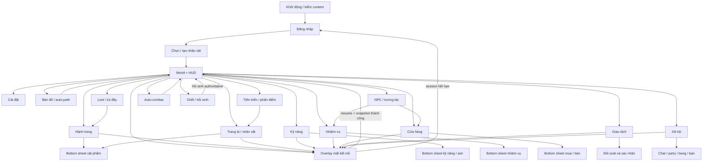

# Bảng tiêu chuẩn thiết kế giao diện

Tài liệu này đặc tả giao diện mobile ngang của VLTK, tổng hợp theo pha 4 CNPM. Nguồn visual canonical là manifest PC tiếng Việt active; implementation Unity hiện hữu chỉ là bằng chứng `DISCOVERED / UNVERIFIED`, ngoại trừ geometry HUD mobile `1280x720` đã được chủ sản phẩm chốt freeze làm authority layout. Ngoại lệ HUD không áp dụng cho panel stale hoặc gameplay. Quyền thao tác thuộc người chơi đã đăng nhập, trừ màn hình boot/auth/tạo nhân vật; DevHarness không xuất hiện trong production.

## Tiêu chuẩn đối với các màn hình

| **Yếu tố** | **Kích thước** | **Canh lề** | **Cách tổ chức** | **Phím nóng / phím tắt** | **Yêu cầu kết xuất** |
| --- | --- | --- | --- | --- | --- |
| Màn hình chính | Landscape tham chiếu `1280x720`; hỗ trợ tỉ lệ `16:9` đến `20:9` | HUD theo baseline mobile freeze `1280x720`; Safe Area chỉ transform toàn HUD root | World + HUD cố định; một primary panel; bottom sheet theo ngữ cảnh | Touch; bàn phím dev giữ mapping PC nếu không xung đột | 30 FPS trên Android 4 GB; tier trung-cao hướng tới 60 FPS; pixel/SPR không nhòe |
| Màn hình nhập liệu | Full viewport; bàn phím/IME chỉ chiếm vùng hệ điều hành | Control trong Safe Area; nội dung đang nhập không bị keyboard che | Login, đặt tên, chat, số lượng, giá; validate tại chỗ và server | `Enter` gửi/xác nhận khi an toàn; `Esc/Back` đóng lớp trên cùng | Tiếng Việt Unicode; che mật khẩu; chống gửi lặp bằng pending state |
| Màn hình tra cứu | Primary panel tối đa vùng an toàn; danh sách cuộn ảo hóa | Tiêu đề trên, filter/search dưới tiêu đề, chi tiết ở bottom sheet | Shop, quest, skill, social; skeleton khi tải; empty/error/retry rõ ràng | Search focus tùy thiết bị | Không dùng dữ liệu cache quá revision; giữ vị trí cuộn khi delta hợp lệ |
| Màn hình kết quả | Dialog hoặc bottom sheet, tối thiểu touch target `48x48 dp` | Canh giữa Safe Area hoặc neo cạnh dưới | Kết quả mua/bán/trade/equip/cast; semantic ACK mới là thành công | Không áp dụng phím bắt buộc | Không hiển thị thành công chỉ từ transport ACK; economy đợi PostgreSQL commit |
| Báo biểu | Không áp dụng | Không áp dụng | Sản phẩm game không in/xuất báo biểu; log vận hành nằm ngoài UI người chơi | Không áp dụng | Không áp dụng vì ngoài phạm vi giao diện người chơi |
| Màn hình thông báo | Toast, dialog xác nhận hoặc reconnect overlay trong Safe Area | Toast trên HUD nhưng không che target/HP; dialog giữa; reconnect toàn màn hình | Một lỗi có mã, thông điệp Việt, hành động khôi phục; lỗi phá hủy cần xác nhận | `Back` chỉ hủy khi action cho phép | Không mất focus/action ngoài ý muốn; không lộ stack trace, token hoặc dữ liệu nhạy cảm |

### Hệ tọa độ, Safe Area và lớp hiển thị

- `UI-STD-001`: orientation khóa landscape; layout được authored trong canvas tham chiếu `1280x720`. Với Safe Area, tính một uniform scale theo hệ số nhỏ hơn của width/height và một translation để toàn root nằm giữa vùng an toàn; letterbox/world camera có thể mở rộng, UI không stretch phi đồng nhất.
- `UI-STD-002`: authority HUD freeze là baseline mobile hiện tại gồm `HudPanelSettings.asset`, `GameHud.uxml`, `GameHud.uss` ở `1280x720`, không phải layout PC. Safe Area chỉ transform toàn bộ `GameHud` root như một khối; không dịch từng cụm, co từng nút, đảo cụm hoặc tái bố trí. Joystick/aim mobile là input overlay đã chốt trong baseline, không được dùng làm lý do sửa geometry.
- `UI-STD-003`: thứ tự lớp là world, HUD freeze, primary panel, bottom sheet, dialog, reconnect/system overlay. Tại một thời điểm chỉ có một primary panel và một bottom sheet tương tác được; mở primary khác đóng primary trước sau khi xử lý dirty state.
- `UI-STD-004`: primary panel chiếm vùng nội dung chính trong Safe Area; chọn một entity mở bottom sheet chi tiết/hành động. Không mở hai cửa sổ PC cạnh nhau trên màn hình hẹp và không dùng drag/drop ở bất kỳ panel nào.
- `UI-STD-005`: mỗi panel lưu `snapshot_revision` và `opened_at`. Khi nhận delta mới hơn, cập nhật tại chỗ; khi resume/reconnect/revision gap hoặc dữ liệu quá TTL miền, khóa mutation, hiển thị “Đang làm mới” và yêu cầu snapshot authoritative. Không render cache stale như dữ liệu hiện hành.
- `UI-STD-006`: ưu tiên SPR/chrome/frame PC bản tiếng Việt mới nhất theo winner first-match. Khi census chứng minh không có bản Việt và asset chỉ có chữ Trung Quốc baked-in, phải giữ chrome/frame PC, thay riêng vùng chữ bằng text runtime tiếng Việt, không để glyph Trung hướng người dùng và đăng ký `VISUAL_DEBT`. Scale/crop/9-slice tạm thời cũng phải có debt, owner và test gỡ nợ; cấm tự vẽ lại visual PC.

### Chuyển đổi panel stale

- Panel/popup hiện tại được xem là legacy stale và phải làm lại song song; HUD root không thuộc phạm vi chuyển đổi này.
- Feature flag `ui.panel_v2.<panel_id>` lấy từ bootstrap server-signed, pin variant suốt vòng mở panel và không đổi khi mutation pending/reconnect. Legacy và v2 dùng cùng command/event/schema nhưng view model tách biệt.
- Rollout theo `internal -> 1% -> 10% -> 50% -> 100%`; lần mở tiếp theo mới nhận thay đổi route. Flag không được đổi business rule, content version, persistence hoặc HUD geometry. Chi tiết tại `delivery/migration-plan.md`.

## Tiêu chuẩn đối với các yếu tố trên màn hình

| **Yếu tố** | **Font type** | **Font size** | **Font Color** | **Canh lề** | **Kích thước** | **Hình dạng** |
| --- | --- | --- | --- | --- | --- | --- |
| Tiêu đề form | Font Việt đóng gói có đủ dấu; fallback được kiểm glyph | `24-32 px` tại `1280x720`, hỗ trợ text scale `100-130%` | Theo palette PC canonical, tương phản `>= 4.5:1` khi là text thiết yếu | Giữa frame hoặc trái theo INI canonical | Không cắt dấu; cao tối thiểu `40 dp` | Text runtime trên chrome/frame SPR PC |
| Label | Cùng font Việt đóng gói | `16-22 px`, số combat không nhỏ hơn `16 px` | Màu PC; trạng thái không chỉ phân biệt bằng màu | Trái; số liệu canh phải khi thành cột | Wrap tối đa 2 dòng, sau đó ellipsis + chi tiết | Text; icon trạng thái có nhãn accessibility |
| Button | Cùng font Việt đóng gói, semibold khi cần | `16-22 px`, text scale `100-130%` | Normal/pressed/disabled đạt tương phản | Giữa touch target | Tối thiểu `48x48 dp`, khoảng cách `8 dp`; hitbox không nhỏ hơn art | SPR PC theo state; vòng focus/pressed runtime không che art |
| Link | Cùng font Việt đóng gói | `16-20 px` | Có underline hoặc icon, không chỉ dùng màu | Theo luồng đọc trái sang phải | Touch target tối thiểu `48 dp` | Text + trạng thái pressed/focus |
| Ô nhập liệu | Cùng font Việt đóng gói; password dùng mask | `18-22 px` | Text/placeholder/error có tương phản | Trái; số lượng canh phải | Cao tối thiểu `48 dp`; không bị IME che | Frame SPR PC + caret/selection runtime |

### Accessibility, phản hồi và input chung

- Mỗi control có accessible name tiếng Việt, role, value/state và thứ tự focus hợp lý; icon-only có nhãn. Không truyền nghĩa chỉ bằng màu, rung hoặc âm thanh.
- Text scale đến `130%` không che nút chính; subtitle/label được wrap hoặc cuộn. Reduced motion tắt screen shake/flash không thiết yếu; hiệu ứng chớp nhanh phải có phương án giảm.
- Haptic: tap chọn nhẹ, cast được server chấp nhận rung trung bình, hành động phá hủy/cảnh báo rung mạnh; không rung khi transport ACK hoặc cast bị từ chối. Cho phép tắt riêng rung, nhạc, hiệu ứng và combat audio.
- Touch exploration không tự kích hoạt mutation. Gesture giữ-kéo aim có vùng hủy rõ; tap kép không được gửi hai economy intent nhờ idempotency/pending state.

# Sơ đồ giao diện tổng quát

Quy tắc Back: đóng dialog, rồi bottom sheet, rồi primary panel; tại HUD mở dialog thoát. Reconnect overlay chặn toàn bộ mutation cho tới khi resume và reconciliation hoàn tất.

# Giao diện chi tiết

## Khởi động và kiểm content

**Tên màn hình**: `UI-BOOT-CONTENT` - Khởi động/xác minh content

**Ý nghĩa**: Khóa build, protocol và content manifest tương thích trước auth/world; không cho chạy production bằng catalog local/mock khi verify thất bại.

**Hình ảnh**: Logo/frame/loading SPR PC Việt canonical; version, tiến độ và lỗi là text runtime tiếng Việt. Nếu không có winner Việt mới được giữ chrome/frame asset Trung và render text Việt kèm `VISUAL_DEBT`.

**Bảng mô tả chi tiết**

| STT | Thao tác | Ý nghĩa | Xử lý liên quan | Ghi chú |
| --- | --- | --- | --- | --- |
| 1 | Mở ứng dụng | Khởi tạo local build | Đọc build/protocol/content pin, không mở world từ cache chưa verify | State `cold-start -> loading-local` |
| 2 | Tải manifest | Kiểm compatibility | Fetch manifest ký, so client/protocol/content version và hash bundle | State `fetching-manifest -> verifying` |
| 3 | Tap Thử lại | Khôi phục lỗi mạng/integrity có thể retry | Retry có backoff; không bỏ qua signature/hash | Không có nút “Vào game vẫn dùng cache” production |
| 4 | Bản build/content không tương thích | Chặn vào game | Hiển thị mã lỗi Việt và hành động cập nhật/thoát được release cho phép | Patcher PC ngoài phạm vi; dùng app/content delivery mobile |
| 5 | Verify thành công | Chuyển auth | Pin `content_version` cho session và asset resolver | Chỉ state `ready` được sang Login |

## Đăng nhập và chọn realm

**Tên màn hình**: `UI-AUTH-LOGIN` - Đăng nhập

**Ý nghĩa**: Xác thực tài khoản, chọn realm khả dụng và bắt đầu bootstrap; người chưa đăng nhập chỉ có quyền dùng các thao tác auth công khai.

**Hình ảnh**: Frame/logo/nút từ SPR PC tiếng Việt canonical; text tài khoản, mật khẩu, lỗi và realm là runtime tiếng Việt. Golden runtime hiện `BLOCKED` do thiếu capture đã pin/reviewer.

**Bảng mô tả chi tiết**

| STT | Thao tác | Ý nghĩa | Xử lý liên quan | Ghi chú |
| --- | --- | --- | --- | --- |
| 1 | Nhập tài khoản/mật khẩu | Cung cấp credential | Validate cục bộ tối thiểu, gửi REST login một lần, che mật khẩu | Không log credential; disable nút khi pending |
| 2 | Chọn realm | Chọn phạm vi persistence | Chỉ hiển thị realm từ response còn hiệu lực | Realm lỗi có trạng thái và retry |
| 3 | Đăng nhập | Nhận token/bootstrap | Chỉ chuyển màn hình sau business success | Lỗi có mã và thông điệp Việt |
| 4 | Quên mật khẩu | Mở luồng reset | REST reset, thông báo trung tính chống dò tài khoản | Bottom sheet hoặc external flow đã duyệt |

## Chọn và tạo nhân vật

**Tên màn hình**: `UI-CHAR-SELECT` - Chọn/tạo nhân vật

**Ý nghĩa**: Hiển thị nhân vật trong realm, tạo nhân vật mới, vào game hoặc thực hiện delete/restore có xác nhận.

**Hình ảnh**: Avatar/body preview dùng SPR PC theo giới tính, hướng, frame và equipment mapping canonical; tên/phái/cấp là runtime tiếng Việt.

**Bảng mô tả chi tiết**

| STT | Thao tác | Ý nghĩa | Xử lý liên quan | Ghi chú |
| --- | --- | --- | --- | --- |
| 1 | Chọn thẻ nhân vật | Xem preview và trạng thái | Bind đúng `character_id`, revision và realm | Skeleton khi đang bootstrap |
| 2 | Tạo nhân vật | Chọn giới tính, ngoại hình, tên | Server validate tên và lựa chọn; preview không thay authority | Không cho glyph lỗi/asset thiếu đi production |
| 3 | Vào game | Mở session realtime | WSS hello/resume rồi snapshot | Không vào world từ cache local |
| 4 | Xóa/khôi phục | Quản lý vòng đời nhân vật | Dialog xác nhận; semantic result sau commit | Không drag/drop thẻ để xóa |

## HUD thế giới và combat

**Tên màn hình**: `UI-HUD-WORLD` - HUD world/combat

**Ý nghĩa**: Điều khiển di chuyển, target, cast, tương tác và mở panel trong world mà không làm sai geometry baseline mobile đã freeze.

**Hình ảnh**: Canvas `1280x720`; cụm chân dung/HP-MP, minimap, chat/menu và skill/action giữ geometry canonical. Safe Area transform toàn HUD root. Ưu tiên SPR PC Việt canonical mới nhất; fallback chỉ được giữ chrome/frame PC và render text Việt runtime khi census chứng minh không có bản Việt.

**Bảng mô tả chi tiết**

| STT | Thao tác | Ý nghĩa | Xử lý liên quan | Ghi chú |
| --- | --- | --- | --- | --- |
| 1 | Kéo joystick | Gửi movement intent trực tiếp | Prediction cục bộ và reconcile snapshot server; quest/minimap/trạm mới được khởi tạo auto-path | Không tap đất để chạy; panel không truyền touch xuống world |
| 2 | Tap attack/skill hoặc giữ-kéo theo hướng | Tự chọn mục tiêu phù hợp mà không chạm actor nhỏ | Dùng target mode và tuple deterministic tại `domains/combat-targeting.md`; hiển thị lock marker prediction | Không tự đổi theo HP/render order; server kiểm lại |
| 3 | Tap skill | Cast nhanh vào target/điểm hợp lệ | Client gửi intent; server tick 18 Hz quyết định | Chỉ một pending cast mới nhất; reject trả cooldown/resource reason |
| 4 | Giữ và kéo skill | Aim hướng/điểm | Hiển thị telegraph, leash/range; thả để gửi; kéo vào vùng hủy để bỏ | Aim visual không chứng minh hit authority |
| 5 | Tap target lock | Khóa/mở khóa mục tiêu | Giữ target tới khi invalid/dead/out hard leash | Auto-combat không tự phá lock ngoài policy |
| 6 | Bật auto-combat | Tự chọn/cast trong hard leash | Server-authoritative; leash breach hủy target và return-to-anchor; terminal stop khi toggle/death/disconnect/transfer/túi đầy | Không mutation item khi combat lock |
| 7 | Mở menu/panel | Điều hướng sang primary panel | Đóng primary cũ, lấy snapshot mới | HUD vẫn render nhưng world input bị panel chặn |
| 8 | Nhận damage/cast/loot | Phản hồi combat | Delta/event cập nhật HP, cooldown, log; haptic chỉ khi semantic event | Không suy thành success từ transport ACK |

## Bản đồ và điều hướng

**Tên màn hình**: `UI-WORLD-MAP` - Bản đồ hiện tại/world và auto-path

**Ý nghĩa**: Xem map/marker canonical, chọn đích đủ lớn và yêu cầu auto-path mà không dùng tap đất trong world để di chuyển.

**Hình ảnh**: Map/marker/frame/icon tái sử dụng SPR PC Việt canonical; map Ba Lăng giữ ID `53`, tuyệt đối không alias `79`. Label/coordinate/action runtime tiếng Việt.

**Bảng mô tả chi tiết**

| STT | Thao tác | Ý nghĩa | Xử lý liên quan | Ghi chú |
| --- | --- | --- | --- | --- |
| 1 | Tap minimap/nút Bản đồ | Mở primary map | Lấy map revision, player location, marker và waypoint | loading/ready/stale/error rõ ràng |
| 2 | Chọn marker từ list/filter | Tránh phải chạm điểm nhỏ | Highlight marker và mở bottom sheet detail | Touch target `>=48dp`; icon map vẫn là visual PC |
| 3 | Tap vị trí hợp lệ trên bản đồ | Tạo path preview | Quantize coordinate, yêu cầu path authority; chỉ hiển thị preview nếu có đường | Đây là auto-path source được phép, không phải teleport/direct movement |
| 4 | Tap Bắt đầu/Dừng | Điều khiển auto-path | Server/session xác nhận destination; joystick, manual cast/combat hoặc invalid path hủy và không tự resume | Auto-path tách riêng auto-combat stop policy |
| 5 | Chọn trạm/chuyển map | Yêu cầu transfer | Xác nhận destination/map ID, state transfer-pending, khóa action lặp | Snapshot map mới mới đóng pending |

## NPC và tương tác ngữ cảnh

**Tên màn hình**: `UI-NPC-CONTEXT` - Chọn NPC/action mobile

**Ý nghĩa**: Tương tác NPC nhỏ bằng selector/context action thay vì yêu cầu tap trực tiếp lên actor.

**Hình ảnh**: Portrait/frame/action icon SPR PC Việt canonical; tên, hội thoại, quest/shop/action là text runtime tiếng Việt.

**Bảng mô tả chi tiết**

| STT | Thao tác | Ý nghĩa | Xử lý liên quan | Ghi chú |
| --- | --- | --- | --- | --- |
| 1 | Tap nút Tương tác khi ở gần | Chọn context candidate | Server/client snapshot lọc interaction radius; 1 candidate mở primary action, nhiều candidate mở list hàng lớn | Không tap actor nhỏ; sort distance rồi `actor_id` |
| 2 | Chọn NPC trong list | Khóa đúng entity | Bind `actor_id`, action revision và portrait/name | Candidate rời range chuyển out-of-range, không action stale |
| 3 | Tap Nói chuyện/Nhận-Trả nhiệm vụ/Mua bán | Gửi primary action | Dùng action ID/content version; server/Lua sandbox validate | Không suy action từ tên NPC |
| 4 | NPC ngoài tầm | Tiếp cận có kiểm soát | Cho phép `Tìm đường` nếu content cung cấp waypoint; không tự teleport | Joystick hủy auto-path |
| 5 | Revision/quest state đổi | Làm mới action | Khóa CTA, request snapshot rồi render lại | Không để action cũ vẫn bấm được |

## Hành trang

**Tên màn hình**: `UI-INV-060` - Hành trang 60 ô

**Ý nghĩa**: Xem đúng 60 ô authoritative, chọn item và thực hiện dùng/mặc/bỏ/bán qua bottom sheet.

**Hình ảnh**: Primary panel dùng frame hành trang SPR PC; lưới `6x10`/60 slot là invariant dữ liệu. Có thể trình bày cuộn/phân trang phù hợp Safe Area nhưng không đổi capacity hoặc đánh số slot.

**Bảng mô tả chi tiết**

| STT | Thao tác | Ý nghĩa | Xử lý liên quan | Ghi chú |
| --- | --- | --- | --- | --- |
| 1 | Mở hành trang | Lấy snapshot túi | Hiển thị skeleton rồi bind 60 slot và revision | Không dùng override 28 ô hiện hữu |
| 2 | Tap một ô | Chọn item | Mở bottom sheet chi tiết/action theo quyền và trạng thái | Tuyệt đối không drag/drop |
| 3 | Tap Dùng/Mặc | Gửi mutation item | Khóa action khi combat/reconnect; idempotency; cập nhật sau semantic ACK | Failure giữ selection và giải thích |
| 4 | Tap Di chuyển rồi tap ô đích | Reorder/merge/swap không kéo thả | Server xử lý atomic theo source/destination slot + revision | Back hủy move mode; xung đột thì refresh |
| 5 | Tap Sắp xếp | Sắp xếp deterministic | Server trả layout/revision mới theo content rule | Filter view không đổi slot index |
| 6 | Tap Tách, chọn số lượng | Tạo chồng mới | Server dùng ô trống có index nhỏ nhất; count > 1 | Túi đầy thì disable Tách, không tạo item tạm |
| 7 | Chọn Dùng/Mặc/Bán/Bỏ | Gửi mutation item | Khóa action khi combat/reconnect; idempotency; cập nhật sau semantic result | Failure giữ selection và giải thích |
| 8 | Nhận delta/revision gap | Đồng bộ túi | Apply delta liên tục; gap thì khóa mutation và refresh snapshot | Không render stale như thành công |

## Loot và hành trang đầy

**Tên màn hình**: `UI-LOOT-FULL` - Loot/reservation và xử lý túi đầy

**Ý nghĩa**: Nhặt loot qua context lớn/auto-loot, bảo toàn item chưa cấp khi 60 slot đầy và dẫn người chơi dọn chỗ mà không tap drop nhỏ.

**Hình ảnh**: Icon/item quality/frame loot từ SPR PC canonical; tên/số lượng/reason runtime Việt. Không vẽ icon placeholder production.

**Bảng mô tả chi tiết**

| STT | Thao tác | Ý nghĩa | Xử lý liên quan | Ghi chú |
| --- | --- | --- | --- | --- |
| 1 | Tap nút Nhặt/auto-loot | Nhặt candidate hợp lệ | Dùng loot/reservation ID; merge stack trước, rồi ô trống index nhỏ nhất theo grant rule | Không cần tap vật phẩm nhỏ trên đất |
| 2 | Grant thành công/một phần | Hiển thị outcome thật | Chỉ cập nhật sau semantic event; item còn lại giữ trạng thái reservation | Không biến transport ACK thành success |
| 3 | `INVENTORY_FULL` | Báo túi 60 ô đầy | Dừng auto-loot/auto-combat theo stop policy; mở sheet `Mở túi`, `Dọn chỗ`, `Thử lại` | Không xóa loot, không tự gửi mail hay tăng capacity |
| 4 | Dọn chỗ rồi Thử lại | Hoàn tất grant | Revalidate reservation expiry, inventory revision và ownership | Expired có reason; không duplicate grant |
| 5 | Reconnect lúc granting | Reconcile unknown outcome | Query snapshot/receipt trước retry | State stale khóa CTA |

## Trang bị và nhân vật

**Tên màn hình**: `UI-EQUIP-CHAR` - Nhân vật/trang bị

**Ý nghĩa**: Xem thuộc tính, slot trang bị và preview ngoại hình; mặc/tháo bằng chọn item và action, không kéo thả.

**Hình ảnh**: Frame/slot/icon PC canonical; avatar compositing body/head/weapon/equipment đúng giới tính, hướng và frame sequence.

**Bảng mô tả chi tiết**

| STT | Thao tác | Ý nghĩa | Xử lý liên quan | Ghi chú |
| --- | --- | --- | --- | --- |
| 1 | Tap slot trang bị | Xem item đang mặc | Bottom sheet hiện thuộc tính và action Tháo | Không drag item giữa túi và slot |
| 2 | Tap Mặc/Tháo | Thay equipment | Server validate class/level/combat lock; commit rồi delta inventory/stats/avatar | Các delta phải cùng revision/transaction logic |
| 3 | Xem preview | Kiểm ngoại hình | Resolve đúng SPR provenance và animation idle | Missing part là lỗi gate, không silent fallback |

## Kỹ năng

**Tên màn hình**: `UI-SKILL-TREE` - Kỹ năng và bộ phím combat

**Ý nghĩa**: Xem cây kỹ năng novice/10 phái, tăng điểm và gán skill vào slot mobile.

**Hình ảnh**: Icon/frame SPR PC canonical; cấp, cooldown, mô tả và chi phí là runtime Việt từ content pin version.

**Bảng mô tả chi tiết**

| STT | Thao tác | Ý nghĩa | Xử lý liên quan | Ghi chú |
| --- | --- | --- | --- | --- |
| 1 | Chọn kỹ năng | Xem level/effect/điều kiện | Bottom sheet bind content version và character revision | Formula authoritative không tính từ prose UI |
| 2 | Tăng điểm | Nâng cấp skill | Dialog nếu cần; server validate/commit rồi delta | Disable khi pending hoặc stale |
| 3 | Chọn “Gán” rồi tap slot | Gán skill vào deck | Lưu loadout theo contract | Không drag/drop icon |
| 4 | Xem thử aim | Học vùng ảnh hưởng | Preview không gửi cast | Telegraph phải khớp targeting spec |

## Tiến triển và phân bổ điểm

**Tên màn hình**: `UI-PROGRESSION-ALLOCATE` - Cấp, EXP và phân điểm

**Ý nghĩa**: Xem tiến triển cấp 1-200, phân thuộc tính/điểm kỹ năng bằng tap/stepper và commit atomic, không kéo thanh hoặc tự tính authority ở client.

**Hình ảnh**: Frame/tab/icon thuộc tính/kỹ năng SPR PC Việt canonical; số điểm, preview và lỗi runtime Việt từ content/session pin.

**Bảng mô tả chi tiết**

| STT | Thao tác | Ý nghĩa | Xử lý liên quan | Ghi chú |
| --- | --- | --- | --- | --- |
| 1 | Mở Tiến triển | Xem cấp/EXP/điểm chưa dùng | Bind character/content revision và cap/rule authoritative | State ready/unspent/stale |
| 2 | Tap `+/-` hoặc giữ nút lặp | Soạn phân bổ mobile | Chỉ sửa draft cục bộ trong giới hạn snapshot | Không drag slider; preview ghi rõ chưa áp dụng |
| 3 | Tap Hoàn tác | Xóa draft | Quay về snapshot đang bind | Không gửi mutation |
| 4 | Tap Áp dụng | Commit phân bổ | Gửi toàn bộ allocation + expected revision/idempotency; server validate/commit atomic | Không apply từng stat nửa chừng |
| 5 | Revision đổi/invalid | Ngăn mất điểm | Giữ draft để đối chiếu, refresh snapshot, yêu cầu người chơi xác nhận lại | Không tự rebase làm đổi ý định |
| 6 | Tẩy điểm nếu content cho phép | Thực hiện action phá hủy/kinh tế | Quote + dialog xác nhận + commit authority | Cost/rule chưa có evidence phải `BLOCKED`, không bịa UX |

## Nhiệm vụ

**Tên màn hình**: `UI-QUEST-LIST` - Danh sách nhiệm vụ

**Ý nghĩa**: Xem nhiệm vụ đang làm/có thể nhận/hoàn tất và điều hướng tới mục tiêu.

**Hình ảnh**: Frame/tab/icon PC canonical; tên, mục tiêu, tiến độ, mô tả và phần thưởng runtime tiếng Việt.

**Bảng mô tả chi tiết**

| STT | Thao tác | Ý nghĩa | Xử lý liên quan | Ghi chú |
| --- | --- | --- | --- | --- |
| 1 | Chọn nhiệm vụ | Xem chi tiết | Bottom sheet bind state/revision | Tiến độ server-authoritative |
| 2 | Tap Theo dõi | Ghim tracker HUD | Chỉ ghim ID, không sao chép state | Tracker cập nhật bằng delta |
| 3 | Tap Tìm đường | Auto-path tới mục tiêu hợp lệ | Dùng map/target canonical; dừng khi invalid | Không teleport ngầm |
| 4 | Nhận/Trả nhiệm vụ | Chuyển state | Server/Lua sandbox validate; semantic result | Pending/reject hiển thị rõ |

## Cửa hàng

**Tên màn hình**: `UI-SHOP-CATALOG` - NPC shop/mall

**Ý nghĩa**: Duyệt catalog được phép và mua/bán item với giá authoritative.

**Hình ảnh**: Frame/shop slot SPR PC canonical; giá, tiền tệ, stock và hạn dùng runtime tiếng Việt.

**Bảng mô tả chi tiết**

| STT | Thao tác | Ý nghĩa | Xử lý liên quan | Ghi chú |
| --- | --- | --- | --- | --- |
| 1 | Chọn item | Xem chi tiết/giá | Bottom sheet dùng quote/version hiện hành | Quote hết hạn bắt refresh |
| 2 | Chọn số lượng và Mua/Bán | Gửi economy intent | Idempotency; server validate và ACK sau PostgreSQL commit | Không optimistic currency |
| 3 | Revision/catalog stale | Ngăn mua sai giá | Khóa CTA, refresh catalog/quote | Không fallback mock production |

## Giao dịch người chơi

**Tên màn hình**: `UI-TRADE-ESCROW` - Giao dịch trực tiếp

**Ý nghĩa**: Lập đề nghị, đối soát hai phía, khóa và xác nhận giao dịch atomic.

**Hình ảnh**: Frame trade PC canonical; hai bên, item, tiền, trạng thái khóa và countdown runtime tiếng Việt.

**Bảng mô tả chi tiết**

| STT | Thao tác | Ý nghĩa | Xử lý liên quan | Ghi chú |
| --- | --- | --- | --- | --- |
| 1 | Tap ô rồi Chọn item | Thêm item từ bottom sheet | Server giữ offer revision; không drag/drop | Thay offer mở khóa xác nhận hai bên |
| 2 | Nhập số tiền | Đề nghị tiền | Validate balance/limit server | Không optimistic debit |
| 3 | Khóa đề nghị | Xác nhận nội dung đang thấy | Hiển thị digest/revision cả hai phía | Bất kỳ đổi nào hủy lock |
| 4 | Xác nhận cuối | Commit atomic | ACK chỉ sau commit; crash/idempotency an toàn | Failure không mất item/tiền |

## Xã hội

**Tên màn hình**: `UI-SOCIAL-HUB` - Chat, đội, bạn bè và bang hội

**Ý nghĩa**: Truy cập catalog xã hội P2-P4 theo phase: kênh chat, party, friend, trade invite, guild và moderation cơ bản.

**Hình ảnh**: Primary panel/tab dùng chrome/icon PC canonical; tên, trạng thái online, role và message runtime tiếng Việt.

**Bảng mô tả chi tiết**

| STT | Thao tác | Ý nghĩa | Xử lý liên quan | Ghi chú |
| --- | --- | --- | --- | --- |
| 1 | Chọn tab/kênh | Đổi danh sách/ngữ cảnh | Fetch snapshot và subscribe delta đúng channel | Unread có số và accessible label |
| 2 | Gửi chat | Gửi message | Rate limit/moderation/server ACK | Không render message rejected như đã gửi |
| 3 | Mời/chấp nhận/rời đội | Quản lý party | Server validate affinity/channel | Kết quả bằng event authoritative |
| 4 | Kết bạn/chặn | Quản lý quan hệ | Confirmation phù hợp, privacy state | Không lộ trạng thái bị chặn quá mức |
| 5 | Bang hội | Xem member/role/action | Quyền action theo role từ snapshot | CTA ẩn/disable có lý do |

## Thú cưỡi và pet

**Tên màn hình**: `UI-COMPANION` - Thú cưỡi và đồng hành

**Ý nghĩa**: Quản lý mount P2 và pet P3 bằng thao tác tap, giữ ownership/stat/combat
authority ở Go và tái sử dụng icon/SPR PC Việt canonical.

**Hình ảnh**: Primary panel có roster/card SPR PC; bottom sheet hiển thị modifier,
level, mode và action runtime tiếng Việt. Không kéo thả mount/pet vào slot.

**Bảng mô tả chi tiết**

| STT | Thao tác | Ý nghĩa | Xử lý liên quan | Ghi chú |
| --- | --- | --- | --- | --- |
| 1 | Chọn tab Mount/Pet và tap card | Xem instance/skill/modifier | Snapshot pin `content_version` và revision | Thiếu asset hiển thị debt, không tự vẽ |
| 2 | Tap Trang bị/Cưỡi/Tháo | Đổi mount active | Server validate owner, map/combat rule rồi commit | Stats/avatar chỉ đổi sau semantic event |
| 3 | Tap Triệu hồi/Thu hồi | Đổi pet active | Exactly-one active, checkpoint và owner attribution | Reject giữ nguyên state/visual |
| 4 | Chọn mode/skill pet | Cấu hình companion | Pet cast qua combat validator/RNG stream | CTA khóa khi stale/reconnect |

## Bang hội

**Tên màn hình**: `UI-GUILD` - Bang hội và phân quyền

**Ý nghĩa**: Tách nghiệp vụ guild P3 khỏi social hub chung để member, role và action
destructive có state/permission/revision rõ ràng.

**Hình ảnh**: Chrome, huy hiệu, icon PC canonical; tên vai trò, log và thông báo là
text runtime tiếng Việt.

**Bảng mô tả chi tiết**

| STT | Thao tác | Ý nghĩa | Xử lý liên quan | Ghi chú |
| --- | --- | --- | --- | --- |
| 1 | Tạo/Xin vào/Rời bang | Chuyển lifecycle membership | Server kiểm capacity/cooldown và idempotency | Exact rule còn BLOCKED theo domain |
| 2 | Tap thành viên | Mở action sheet | Action theo role/RBAC từ snapshot | Không client tự nâng quyền |
| 3 | Đổi role/Kick | Mutation destructive | Dialog xác nhận + expected revision + audit | Pending/reconnect phải reconcile |
| 4 | Xem log/thông báo | Audit hoạt động bang | Phân trang/snapshot, không lộ dữ liệu ngoài quyền | Empty/error/retry đầy đủ |

## PvP, sự kiện và endgame

**Tên màn hình**: `UI-ENDGAME` - PK, event, ladder, boss và chuyển sinh

**Ý nghĩa**: Catalog UI P4 cho rule server-authoritative, admission event, điểm/xếp
hạng, reward idempotent và rollback.

**Hình ảnh**: Frame/tab/icon PC canonical; timer, rule, score, rank, contribution và
reward dùng text/số runtime tiếng Việt.

**Bảng mô tả chi tiết**

| STT | Thao tác | Ý nghĩa | Xử lý liên quan | Ghi chú |
| --- | --- | --- | --- | --- |
| 1 | Chọn PK mode | Yêu cầu đổi quan hệ chiến đấu | Server kiểm map/event/team/guild/cooldown | Không optimistic đổi màu/nameplate |
| 2 | Tap event và Đăng ký | Admission vào event | Kiểm lịch ký, eligibility, capacity, party và epoch | Expired/full có reason ổn định |
| 3 | Xem score/ladder/boss | Theo dõi kết quả authoritative | Delta có revision; tie-break deterministic | Gap chuyển Refreshing |
| 4 | Nhận reward | Grant đúng một lần | Transaction + idempotency + ACK sau commit | Không confetti/rung khi transport ACK |
| 5 | Xác nhận chuyển sinh | Mutation endgame destructive | Preview state trước/sau, dialog và checkpoint | Rollback/reject giữ state cũ |

## Cài đặt

**Tên màn hình**: `UI-SETTINGS` - Cài đặt game và trợ năng

**Ý nghĩa**: Điều chỉnh âm thanh, rung, đồ họa, text scale, reduced motion, target/input và tài khoản.

**Hình ảnh**: Frame/tab/slider SPR PC canonical nếu có; label/value runtime tiếng Việt.

**Bảng mô tả chi tiết**

| STT | Thao tác | Ý nghĩa | Xử lý liên quan | Ghi chú |
| --- | --- | --- | --- | --- |
| 1 | Chỉnh BGM/SFX/combat/UI | Điều chỉnh nhóm audio | Preview có throttle; lưu local/account theo policy | Có mute riêng; không gộp mọi âm thanh |
| 2 | Bật/tắt haptic | Kiểm soát rung | Tôn trọng setting và system capability | Gameplay không phụ thuộc rung |
| 3 | Text scale/reduced motion | Trợ năng | Reflow ngay, giữ touch target | Gate ở `100%` và `130%` |
| 4 | Đồ họa/FPS | Phù hợp thiết bị | Apply tier an toàn, cảnh báo restart nếu cần | Không làm đổi logic/tick |
| 5 | Đăng xuất | Kết thúc session | Confirm, REST logout, xóa token nhạy cảm | Quay về login |

## Chết và hồi sinh

**Tên màn hình**: `UI-DEATH-REVIVE` - Chết/countdown/hồi sinh

**Ý nghĩa**: Chặn combat intent khi chết, trình bày lựa chọn hồi sinh authoritative và chỉ trở lại world sau event revived.

**Hình ảnh**: Frame/icon death/revive SPR PC Việt canonical; countdown, nguyên nhân và option runtime Việt. Penalty/địa điểm chưa có PC evidence phải `BLOCKED` kèm blocker, không tự điền.

**Bảng mô tả chi tiết**

| STT | Thao tác | Ý nghĩa | Xử lý liên quan | Ghi chú |
| --- | --- | --- | --- | --- |
| 1 | Nhận `CombatEvent.kind=DEATH` cho player | Vào state dead | Dừng auto-combat/auto-path, hủy aim/pending theo reason, khóa movement/cast | Không dự đoán chết chỉ từ HP visual |
| 2 | Tải lựa chọn hồi sinh | Hiển thị option hợp lệ | Server trả option, countdown, cost/penalty/location và revision | Không hard-code “tại chỗ/thành” nếu content chưa chứng minh |
| 3 | Tap option hồi sinh | Gửi `ReviveCommand` với `expected_death_revision` | Một intent pending; server validate option/countdown/cost/location từ `ReviveState` | Disable double tap; failure giữ overlay và reason |
| 4 | Nhận `CombatEvent.kind=REVIVE` + snapshot | Trở lại world | Reconcile HP/MP/state/position rồi đóng overlay | `CommandResult=COMMITTED` và semantic event mới là success |
| 5 | Reconnect khi chết | Khôi phục đúng state | Resume snapshot; nếu vẫn dead mở lại option/countdown authoritative | Không reset countdown local |

## Auto-combat

**Tên màn hình**: `UI-AUTO-COMBAT` - Trạng thái/cấu hình auto-combat mobile

**Ý nghĩa**: Bật/tắt automation trong anchor/hard leash, dùng chung target/cast validator manual và cho manual input soft override rõ ràng.

**Hình ảnh**: Badge/nút/skill icon/frame SPR PC Việt canonical; radius/stop reason/cấu hình runtime Việt. Có thể tham khảo logic UX `~/Projects/vltk`, không lấy visual của game tham khảo.

**Bảng mô tả chi tiết**

| STT | Thao tác | Ý nghĩa | Xử lý liên quan | Ghi chú |
| --- | --- | --- | --- | --- |
| 1 | Tap Auto | Bật tại anchor hiện tại | Gửi start intent với rule deck/content revision; server xác nhận anchor/hard leash | State starting -> active; không tự mở rộng leash |
| 2 | Tap badge/cài đặt | Xem rule deck lớn, dễ chạm | Bottom sheet chọn skill/loot/stop option theo contract | Gán skill bằng tap rồi tap slot, không drag/drop |
| 3 | Tap skill/attack manual | Soft override combat | Manual intent mới nhất ưu tiên, sau recovery auto dùng lại cùng selector | Không tạo target policy thứ hai |
| 4 | Kéo joystick | Soft override movement | Hủy approach hiện tại; auto không kéo player ngược tức thì, chỉ resume nếu vẫn trong leash/policy | Auto-path là state độc lập |
| 5 | Tap Dừng | Dừng chủ động | Gửi stop intent, UI chờ reason/event | Không chỉ tắt badge local |
| 6 | Vượt hard leash | Quay về anchor cố định | Hủy target/approach, server điều hướng về anchor; không scan ngoài leash | Không tự mở rộng radius hoặc đổi anchor |
| 7 | Toggle/death/reconnect/transfer/túi đầy | Dừng terminal an toàn | Server phát stopped reason; reconnect không tự bật lại nếu chưa có resume policy | Full bag dừng loot/combat để tránh bỏ vật phẩm |

## Mất kết nối và khôi phục phiên

**Tên màn hình**: `UI-RECONNECT` - Reconnect/resume/reconciliation

**Ý nghĩa**: Chặn mutation, thông báo trạng thái mạng và khôi phục session mà không nhân đôi action hay hiển thị state stale.

**Hình ảnh**: Overlay toàn viewport, spinner/progress và frame thông báo PC canonical; trạng thái/mã lỗi runtime tiếng Việt.

**Bảng mô tả chi tiết**

| STT | Thao tác | Ý nghĩa | Xử lý liên quan | Ghi chú |
| --- | --- | --- | --- | --- |
| 1 | Mất heartbeat/WSS | Vào reconnect | Freeze mutation/input combat, giữ read-only visual có nhãn stale | Không tự báo skill/economy thành công |
| 2 | Tự thử lại | Resume session | Backoff có jitter; gửi resume token/last sequence | Có nút Thử lại khi phù hợp |
| 3 | Resume thành công | Reconcile | Nhận snapshot/delta, xử lý pending intent theo idempotency, rồi bỏ overlay | Panel đang mở phải refresh revision |
| 4 | Resume thất bại/session hết | Quay lại auth | Nêu lý do an toàn, bảo toàn dữ liệu đã commit | Không fallback C# mock/catalog |
