# Miền content, asset, avatar và audio

## Phạm vi và authority

Miền này sở hữu discovery/resolve/extract/compile content, provenance package, asset visual, map bundle identity, avatar compositing, audio catalog và golden/parity gate. Runtime production chỉ đọc content bundle immutable đã pin; `~/Projects/vltktool` là công cụ duy nhất để resolve/extract/hash/encoding từ corpus PC, còn `/var/www/jx-source` luôn read-only.

Thứ tự authority là manifest tiếng Việt active `bin/client/package.ini`, package mở thành công theo key số tăng dần và lookup first-match; tiếp theo là client source/config/PAK matching. Package không active không được tham gia winner dù tên/mtime trông mới hơn. `~/Projects/vltk` và Unity hiện hữu chỉ là reference/as-is.

## Invariant content và provenance

| ID | Invariant |
| --- | --- |
| `CONTENT-INV-001` | Mọi bundle pin `content_version`, locale, source revision và manifest SHA-256; production không hot-reload. |
| `CONTENT-INV-002` | Mọi artifact có package index/name, logical path bytes, UID, byte count, raw/decoded SHA-256, encoding, `vltktool` revision/command và winner reason. |
| `CONTENT-INV-003` | Resolve theo first-match của manifest active; cấm alphabetical fallback, đoán decode, tự rehash hoặc trộn asset nhiều phiên bản. |
| `CONTENT-INV-004` | Map Ba Lăng là canonical `map_id=53`; không remap/alias/fallback sang folder/catalog `79`. Dữ liệu `79` chỉ được giữ làm fixture/debt ngoài production. |
| `CONTENT-INV-005` | Coverage catalog có owner cho 100% skill/map/NPC/item/quest/script/UI/audio/avatar được phát hiện; entity vô chủ làm fail release. |
| `CONTENT-INV-006` | Missing canonical asset là lỗi rõ hoặc block release; không silent fallback sang mock, package inactive, placeholder hay asset khác ID. |
| `CONTENT-INV-007` | Static evidence tối đa `SPECIFIED`; visual/audio/avatar chỉ `PARITY_DONE` khi có PC golden, mobile capture và reviewer sign-off cùng revision. |

## Pipeline package và bundle

```mermaid
flowchart LR
    SNAP[Khóa source snapshot] --> MAN[Đọc package.ini active]
    MAN --> OPEN[Mở package theo key số tăng]
    OPEN --> RESOLVE[vltktool resolve first-match]
    RESOLVE --> EXTRACT[vltktool extract/decode]
    EXTRACT --> HASH[Hash raw + decoded]
    HASH --> CATALOG[Catalog + provenance]
    CATALOG --> COMPILE[Compiler offline]
    COMPILE --> VALIDATE[Schema/coverage/golden gate]
    VALIDATE --> PUBLISH[Bundle immutable]
```

### Manifest artifact tối thiểu

| Trường | Ý nghĩa | Gate |
| --- | --- | --- |
| `content_version`, `bundle_id`, `locale` | Identity phát hành | Duy nhất, immutable, locale `vi-VN` khi user-facing |
| `source_revision`, `package_manifest_sha256` | Snapshot corpus | Khớp evidence ledger |
| `package_index`, `package_name`, `winner_reason` | Provenance lookup | Đúng manifest order/first-match |
| `logical_path_bytes`, `uid` | Identity legacy | Byte-preserving; không normalize làm đổi hash |
| `raw_sha256`, `decoded_sha256`, `byte_count`, `encoding` | Toàn vẹn và decode | Reproducible trên runner sạch |
| `vltktool_revision`, `vltktool_command` | Reproduce extraction | Revision pin, command không chứa secret |
| `entity_type`, `entity_id`, `owner_domain` | Coverage/trace | Không entity vô chủ |
| `golden_ids`, `debt_ids`, `status` | Quality lifecycle | Không release khi gate/debt policy chưa đạt |

Production startup kiểm signature/schema/hash/dependency/content version trước bootstrap. Sai hash/version/locale hoặc thiếu dependency phải dừng rõ ràng; không tải lẫn bundle từ hai version và không fallback DevHarness.

## Map 53: cấm remap 79

As-is đã phát hiện `MapRenderer.LocalDataMapIdOverrides[53] = 79`, dùng vùng test `Map_79_C`. Đây là gap/debt, không phải authority. To-be:

1. Resolve maplist active và toàn bộ reference terrain/region/obstacle/object/minimap cho `map_id=53` qua `vltktool`.
2. Compile bundle với identity `map_id=53`; mọi folder/key/index nội bộ cũng giữ 53 hoặc identity content-addressed không giả map ID.
3. Validator fail nếu manifest production chứa `source_map_id=79`, `runtime_map_id=53`, alias `53->79`, path `Map_79_*` cho Ba Lăng hoặc fallback equivalent.
4. Golden map kiểm spawn reference, bounds, obstacle checksum, region coverage, minimap transform và visual capture của chính corpus 53.
5. Fixture 79, nếu cần giữ để phát triển, phải nằm DevHarness, gắn `VISUAL_DEBT`/`CONTENT_DEBT`, không được đóng production bundle.

## Avatar và character visual

Avatar gồm portrait UI và world character compositing. Catalog phải khóa giới tính, môn phái/điều kiện, body/head/weapon/equipment/horse part, action, 8 hướng nếu nguồn định nghĩa, frame count/order/timing, pivot/reference pixel, sorting offset, palette/blend và SPR UID/path provenance.

| State/case | Nội dung gate |
| --- | --- |
| Character select | Portrait/body đúng `character_id`, giới tính, appearance selection và locale text |
| Idle/walk/run/sit | Part đồng bộ action/direction/frame clock; chân không trượt do pivot sai |
| Cast/hit/death | Frame sequence/timing/event marker khớp golden; không reuse animation khác để che missing |
| Equip/unequip | Body/head/weapon variant đổi atomic với inventory/stat revision; không part cũ sót lại |
| Mount | Rider/horse hướng, pivot và sorting đúng; missing horse part fail rõ |
| Reconnect/map transfer | Rehydrate cùng appearance revision; không flash placeholder/fallback gender |

Portrait parser/visual classes Unity hiện hữu chỉ chứng minh đã có đường code, chưa chứng minh catalog đầy đủ hoặc parity. Missing part/UID, frame count khác, pivot lệch hoặc fallback sang variant mặc định phải được ghi asset error/debt, không silent success.

## Audio

Catalog audio bao phủ BGM, ambient, UI, combat, skill, NPC/voice nếu corpus có. Mỗi cue ghi event ID, source UID/path/package, codec, sample rate/channels/duration, loop points, gain category, spatial/priority/concurrency policy, locale và hash. Mapping `skill_id/event -> cue_id` phải versioned cùng gameplay content.

| Tình huống | Hành vi bắt buộc |
| --- | --- |
| Vào map 53 | Chọn BGM/ambient từ map content 53; chuyển track/fade theo canonical evidence |
| Cast skill | Cue phát theo semantic combat event/timing marker, không chỉ theo button tap hoặc transport ACK |
| Spam combat | Concurrency/priority không cắt cue thiết yếu hoặc gây clipping; deterministic event mapping |
| UI action | Selection/pending/success/failure là cue khác khi canonical có; mute UI được tôn trọng |
| Background/resume | Pause/resume/fade theo OS policy; không phát chồng BGM sau reconnect |
| Missing/corrupt clip | Telemetry + lỗi gate; không thay bằng clip cùng tên gần giống/package inactive |

Người chơi điều chỉnh riêng BGM, ambient/SFX, combat và UI, cùng master/mute nếu product contract quy định. Audio cue thiết yếu phải có visual/text equivalent; accessibility không phụ thuộc âm thanh.

## Golden manifest và parity gate

Golden metadata lưu Git; raw PNG lossless, WAV/PCM reference và video/capture lớn lưu MinIO content-addressed. Mỗi golden pin source/content/tool/build/device revision, input seed/timeline, viewport/audio config, artifact SHA-256, oracle locator, tolerance theo case và reviewer.

| ID | Gate | Điều kiện đạt |
| --- | --- | --- |
| `GOLD-0004` | Package reproducibility | Hai extraction sạch cho cùng snapshot tạo catalog/bundle/hash giống nhau |
| `GOLD-0003` | Map identity/parity | Không remap79; region/obstacle/minimap/spawn checksum và runtime capture map 53 được reviewer duyệt |
| `GOLD-0009` | Avatar matrix | 100% case discovered theo giới tính/action/hướng/equipment có part/frame/pivot/timing hợp lệ; case capture qua review |
| `GOLD-0010` | Audio identity | 100% cue discovered có provenance; decoded PCM hash/format/loop/timing khớp oracle theo case |
| `TEST-UI-007` | SPR UI | Ưu tiên UID/frame/state của SPR PC Việt; nếu không có winner Việt thì chrome/frame PC gốc + text runtime Việt + debt/OCR |
| `PAR-0001` | Coverage | 100% entity discovered có owner, bundle, source evidence và gate status |

Skill visual vẫn dùng SSIM từng case `>=0.99`; UI kiểm asset-level và HUD baseline; map/avatar/audio dùng gate riêng ở trên, không lấy SSIM trung bình để che case fail. Audio so decoded PCM/loop/timeline theo cue thay vì chỉ so tên file hoặc dung lượng.

## Failure mode và acceptance

| ID | Failure | Xử lý | Acceptance evidence |
| --- | --- | --- | --- |
| `TEST-CONTENT-001` | Hai package active chứa cùng UID/path | Winner đúng first-match; catalog ghi cả candidate và winner reason | Fixture package order + manifest diff |
| `TEST-CONTENT-002` | Package inactive có asset “mới hơn” | Không được chọn | Negative resolver test |
| `TEST-CONTENT-003` | Encoding/path byte lạ | `vltktool` bảo toàn bytes và decode có provenance; không đoán | Golden raw/decoded hash |
| `TEST-MAP-053` | Bundle/map code cố alias 53 sang 79 | Validator release fail | Scan manifest/path/config + runtime assertion map identity |
| `TEST-AVATAR-001` | Thiếu một part/frame/direction | Case fail rõ, không silent fallback | Matrix report + capture artifact |
| `TEST-AUDIO-001` | Clip trùng tên khác package hoặc corrupt | Chọn theo manifest hoặc fail hash/decode | Resolver + PCM golden test |
| `TEST-BUNDLE-001` | Hash/version/locale mismatch lúc boot | Chặn bootstrap, mã lỗi có thể hỗ trợ | Tampered bundle integration test |
| `TEST-COVERAGE-001` | Entity discovered không owner/golden status | Premerge/release fail theo lifecycle | Coverage report 100% |

Live PC runtime capture hiện `BLOCKED`; DRI content phải cung cấp trusted binary/config/server stack và reviewer trước khi chuyển `GOLD-0003`, `GOLD-0009`, `GOLD-0010` hoặc `GOLD-0007` sang trạng thái được phê duyệt để hoàn tất parity.
