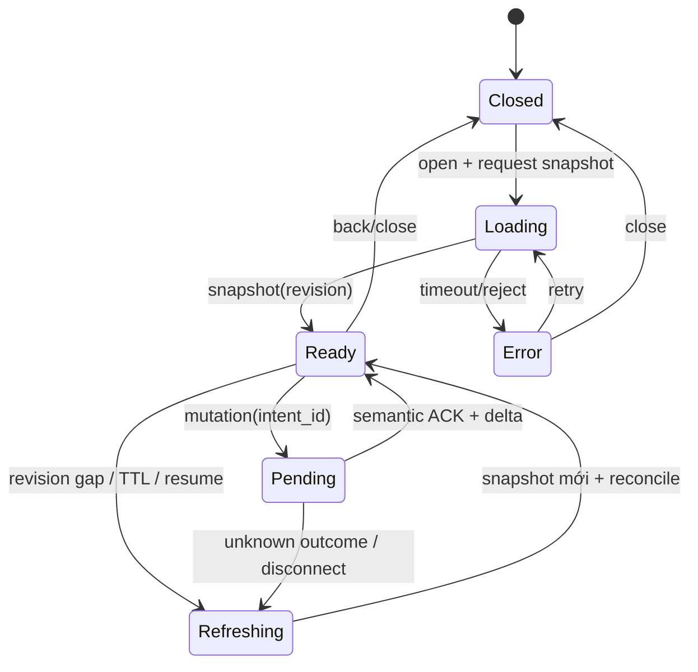

# Miền UI, HUD và panel

## Phạm vi và nguồn

Miền này sở hữu layout HUD, input touch, vòng đời primary panel/bottom sheet/dialog, trạng thái stale/reconnect, accessibility, haptic và kiểm visual UI. Nó không sở hữu công thức combat, inventory transaction hay social/economy authority. Nguồn visual theo `governance/source-authority.md`: manifest PC tiếng Việt active và winner package do `vltktool` chứng minh; Unity hiện hữu mặc định chỉ là as-is. Ngoại lệ được chủ sản phẩm chốt là geometry HUD mobile hiện tại `1280x720`, được freeze làm authority layout; ngoại lệ này không nâng panel stale hay gameplay Unity thành canonical.

| ID | Invariant |
| --- | --- |
| `UI-INV-001` | Viewport sản phẩm là landscape, authored ở hệ tọa độ tham chiếu `1280x720`; UI không stretch phi đồng nhất. |
| `UI-INV-002` | Authority geometry HUD là baseline mobile hiện tại trong canvas `1280x720`. Safe Area chỉ được áp một uniform scale + translation lên toàn `GameHud` root; cấm dịch/co từng cụm. |
| `UI-INV-003` | Chỉ một primary panel và một bottom sheet tương tác tại một thời điểm; dialog/reconnect chặn input lớp dưới. |
| `UI-INV-004` | Tất cả item/equipment/skill assignment dùng tap, chọn và action; tuyệt đối không drag/drop. |
| `UI-INV-005` | Hành trang luôn thể hiện capacity authoritative 60 slot, `slot_index 0..59`; layout mobile không được đổi capacity thành 28. |
| `UI-INV-006` | Panel có `snapshot_revision`; gap/resume/TTL hết hạn khóa mutation và refresh authoritative trước khi tiếp tục. |
| `UI-INV-007` | Transport ACK không được kích hoạt success visual/haptic; mutation chỉ success sau semantic ACK/event phù hợp. |
| `UI-INV-008` | Ưu tiên SPR PC Việt canonical mới nhất. Nếu census chứng minh chỉ có baked Chinese thì giữ chrome/frame PC, render text Việt runtime và bắt buộc `VISUAL_DEBT`; cấm tự vẽ lại visual. |
| `UI-INV-009` | Scale/crop/9-slice/anchor khác golden phải ghi `VISUAL_DEBT`; không được che bằng tolerance tổng hợp. |

## Geometry HUD freeze

Authority HUD không phải layout PC và cũng không phải đề xuất panel mới: nó là baseline mobile hiện hữu được pin bởi `Assets/UI/HUD/HudPanelSettings.asset` reference resolution `1280x720`, `GameHud.uxml` root `GameHud` và `GameHud.uss` `.hud-root 1280x720`. SHA-256 tại thời điểm đặc tả lần lượt là `6e17ee936f7a8cecfc3626b055ee5441d919ac009b1f39a3da73e9578f5106cd`, `e9978c910d908f949c92363f85dab49fb3a6b3ef06eac6b495f06ea203b4960a` và `df7e7250c12f278f69bc10ecc04a50b54df6cfd40f0210dd587cc4c379f80699`. Thay đổi hash không tự động thay authority; phải review diff và tạo baseline mới.

Canvas logic có gốc trái-trên `(0,0)`, kích thước `1280x720`. Đổi Safe Area vật lý về cùng orientation, tính `s = min(safe_width/1280, safe_height/720)`, rồi đặt đúng một transform `translate + uniform scale` lên toàn `GameHud` root để root nằm giữa Safe Area. Mọi con HUD giữ nguyên local position/size/anchor/z-order/hitbox; cấm per-cluster translation/scale, wrap, đổi thứ tự hoặc “né notch” riêng. Phần viewport dư thuộc world/letterbox policy và không trở thành chỗ tái bố trí HUD.

| Cụm | Neo canonical | Nội dung bắt buộc | Input |
| --- | --- | --- | --- |
| Player status | Trái-trên | Portrait, tên/cấp, HP/MP và trạng thái thiết yếu | Tap mở nhân vật; không che world target |
| Target status | Trên, cạnh player status theo baseline | Portrait/name/HP target, lock marker | Tap lock/unlock; accessible state |
| Minimap | Phải-trên | Map 53, tọa độ, marker và nút mở map | Tap mở primary map; không alias 53 thành 79 |
| Chat/menu | Trái-dưới/theo baseline | Kênh chat, unread và lối mở panel | Không chiếm gesture joystick |
| Combat cluster | Phải-dưới | Primary attack, 5 skill slot, deck, target lock, cancel zone khi aim | Tap cast; giữ-kéo aim; thả gửi; kéo vào cancel hủy |
| Mobile movement overlay | Trái-dưới trong vùng được duyệt | Joystick là direct movement duy nhất | Auto-path chỉ khởi tạo từ quest/minimap/trạm; không tap đất để chạy |

Bounding box/hitbox/z-order phải được xuất từ chính baseline mobile pin ở trên thành HUD geometry manifest. Manifest và trusted screenshot runtime đang `BLOCKED` (DRI UI, thiếu capture/manifest); cho tới khi có manifest, cấm sửa geometry. PC INI chỉ dùng chứng minh provenance visual/SPR, không được ghi đè layout HUD mobile đã được người dùng chốt.

## State machine panel

### Quy tắc stale và pending

- Mỗi view model mang `entity_id`, `snapshot_revision`, `content_version`, `received_at` và connection epoch. TTL do domain authority quy định; UI không tự bịa TTL chung.
- Delta đúng revision được apply tuần tự. Gap, epoch đổi, app resume hoặc `content_version` đổi chuyển `Refreshing`; mutation CTA disabled và có accessible status “Đang làm mới”.
- Disconnect khi mutation pending tạo trạng thái `unknown outcome`, không rollback/commit giả. Sau resume, UI đối chiếu `intent_id`, snapshot và semantic event trước khi phát success/failure.
- Mở lại panel luôn revalidate revision. Cache chỉ được dùng làm placeholder có nhãn stale, không dùng để tính giá, capacity, cooldown hay quyền action.

## Mô hình interaction mobile

### Primary panel và bottom sheet

- Primary panel chứa catalog/list/grid và filter. Tap row/slot mở bottom sheet chứa detail cùng action hợp lệ theo authority. Back đóng dialog, bottom sheet rồi primary panel.
- Khi mở primary panel khác, coordinator yêu cầu panel hiện tại resolve pending/dirty state; không stack nhiều cửa sổ PC. Dialog chỉ dùng cho destructive action, final trade confirm hoặc lỗi cần quyết định.
- Touch bên ngoài sheet chỉ đóng khi không có pending/destructive choice. Gesture scroll không được truyền xuống world.

### Hành trang không kéo thả

| Ý định | Chuỗi tap mobile | Transaction authoritative | Khi túi đầy/xung đột |
| --- | --- | --- | --- |
| Xem/dùng/mặc/bán/bỏ | Tap item -> bottom sheet -> action | Gửi `intent_id`, item instance, source slot và revision; apply sau semantic result | Giữ selection, nêu reason; không optimistic remove/currency |
| Di chuyển/đổi chỗ | Tap item -> `Di chuyển` -> tap ô đích -> xác nhận nếu có rủi ro | Server move vào ô trống, merge stack tương thích hoặc swap hai item trong một transaction | Revision đổi thì hủy mode và refresh; không kéo icon |
| Sắp xếp | Tap `Sắp xếp` -> xác nhận | Server trả layout deterministic theo rule content/version và revision mới | Không chạy client-only rồi ghi đè server |
| Tách chồng | Tap item -> `Tách` -> stepper số lượng -> `Tạo chồng` | Server đặt vào ô trống có `slot_index` nhỏ nhất; action chỉ bật khi count > 1 | Không có ô trống thì disable với “Hành trang đã đầy”; không tạo item tạm |
| Nhặt loot | Tap context/auto-loot theo policy | Merge stack trước, sau đó cấp từng item vào ô trống nhỏ nhất, atomic theo grant rule | `INVENTORY_FULL`: item chưa cấp vẫn ở loot/reservation theo domain; không xóa, không tự gửi mail |
| Mặc/tháo khi đầy | Chọn item -> Mặc/Tháo | Swap one-for-one được phép nếu transaction không tăng số slot; unequip cần ô trống/merge | Reject trước commit nếu cần thêm slot; stats/avatar không đổi nửa chừng |

Mọi loại item/equipment chiếm đúng một slot; count stack không đổi footprint. Filter/sort view không đổi `slot_index`. Tap ô rỗng ngoài move mode chỉ bỏ selection; tap Back trong move mode hủy mode, không mutation.

### Contract feature flag panel mới

- Key canonical `ui.panel_v2.<panel_id>`; payload bootstrap được server ký gồm `variant=legacy|v2`, cohort, `min_client_version`, `content_version`, rollout basis points, owner, expiry, rollback key và reason. Unknown/expired/incompatible flag phải fail closed về variant đã được release manifest cho phép, không tự suy đoán.
- Variant được pin khi mở panel và giữ tới khi đóng. Không đổi variant khi bottom sheet/mutation đang pending; reconnect phải reconcile intent/revision trước rồi mới được route lại.
- Legacy và v2 dùng cùng domain command/event/schema, nhưng không dùng chung mutable view model. Telemetry bắt buộc ghi flag revision, variant, panel state, error/recovery và không chứa credential/chat riêng tư.
- Flag chỉ điều phối panel/popup stale được làm lại; tuyệt đối không điều phối hoặc thay geometry HUD freeze. Production không cho fallback legacy nếu legacy đã bị retirement gate loại khỏi release manifest.
- Rollout `internal -> 1% -> 10% -> 50% -> 100%`, mỗi nấc cần crash/error/unknown-outcome/accessibility/parity gate. Rollback chỉ đổi route cho lần mở kế tiếp; mutation đã commit không rollback dữ liệu.

### Combat input, target và aim

| Input | Client feedback | Intent gửi server | Failure |
| --- | --- | --- | --- |
| Tap attack/skill hoặc giữ-kéo theo hướng | Highlight/lock candidate được auto-acquire | `target`/`cast` theo policy; NPC dùng Primary context action | Xóa candidate nếu invalid; không yêu cầu tap actor nhỏ |
| Tap skill | Pressed/cooldown preview | Cast vào locked target hoặc smart target hợp lệ | Server reject phục hồi state, không rung success |
| Giữ-kéo skill | Aim telegraph, range/leash, cancel zone | Chỉ gửi cast khi thả ngoài cancel zone | Cancel không gửi cast; lost pointer hủy an toàn |
| Cast tiếp khi một cast pending | Slot mới hiển thị pending | Chỉ giữ pending cast mới nhất theo contract | Intent cũ bị supersede có state rõ |
| Target lock | Marker/name/HP cố định | Lock/unlock intent nếu contract cần | Tự mở lock khi target dead/invalid/out hard leash |
| Auto-combat | Badge rõ và nút dừng | Policy server-authoritative trong hard leash | Leash breach hủy target/approach và return-to-anchor; terminal stop khi toggle/death/disconnect/transfer/túi đầy |

Telegraph/aim là prediction visual, không phải hit result. Target policy cạnh tranh trong code hiện hữu là gap: production chỉ dùng policy đã reconcile với contract combat, không tự chọn implementation theo thứ tự khởi tạo.

## Catalog màn hình và trạng thái bắt buộc

| Màn hình | Primary content | Bottom sheet/dialog | State bắt buộc |
| --- | --- | --- | --- |
| Login | Credential, realm, auth CTA | Reset password, lỗi auth | idle, validating, pending, rate-limited, error |
| Boot/content | Version/build/content manifest và tiến độ xác minh | Retry/update bắt buộc/lỗi integrity | cold-start, loading-local, fetching-manifest, verifying, ready, offline-blocked, incompatible, integrity-error |
| Character | Danh sách/preview/create | Delete/restore confirm | loading, empty, ready, pending, error |
| World map | Map hiện tại/world, marker, tọa độ, destination | Marker detail; xác nhận auto-path/trạm | loading, ready, no-path, path-preview, auto-path-active, transfer-pending, stale |
| NPC/context | Portrait/name/action canonical | Talk/quest/shop/primary action sheet | candidate-none, one-candidate, choose-candidate, pending, out-of-range, stale |
| Inventory | 60 slot `0..59`, tiền, filter | Item detail; Dùng/Mặc/Bán/Bỏ | skeleton, empty-slot, selected, pending, stale, full |
| Loot/full bag | Loot/reservation và capacity | Item detail; Mở túi/Dọn chỗ/Thử lại | available, granting, partial, full, expired, stale |
| Equipment | Avatar, stats, equipment slots | Item detail; Mặc/Tháo | missing asset, pending, combat-locked, stale |
| Skill | Novice/10 phái, level, loadout | Skill detail; Tăng/Gán; aim preview | locked, available, cooldown, pending, stale |
| Progression | Cấp/EXP/điểm thuộc tính/điểm kỹ năng | Phân bổ/tẩy điểm xác nhận | ready, unspent, editing, invalid, pending, committed, stale |
| Quest | Active/available/completed | Detail; Theo dõi/Tìm đường/Nhận/Trả | empty, progress, completable, pending, stale |
| Death/revive | Countdown, nguyên nhân chết, lựa chọn hồi sinh | Xác nhận điểm hồi sinh | dead, revive-options-loading, countdown, pending, revived, rejected |
| Auto-combat | Badge/anchor/leash/rule deck | Cấu hình skill/loot/stop policy | off, starting, active, soft-override, leash-blocked, stopping, stopped-reason, reconnect-blocked |
| Shop | Catalog, stock, currency | Quote/quantity/confirm | loading, quote-expired, insufficient, pending, committed |
| Trade | Hai offer và digest | Final confirm/cancel | editing, locked-one, locked-both, committing, committed, aborted |
| Social | Chat/party/friend/guild tabs | User/action/chat sheet | offline, empty, unread, permission-denied, rate-limited |
| Mount/pet | Mount inventory, pet roster, active companion và modifier | Equip/Ride/Dismount/Summon/Dismiss/Mode | loading, no-owned, ready, restricted, pending, active, stale |
| Guild | Overview, member/role/applications và log | Member/role/destructive confirmation | no-guild, loading, ready, permission-denied, pending, stale |
| PvP/endgame | PK mode, event list/timer, ladder, boss contribution, reward/rebirth | Enroll/PK/reward/rebirth confirmation | unavailable, scheduled, enrolling, active, finished, reward-pending, stale |
| Settings | Audio/haptic/a11y/graphics/account | Logout confirm | applied, restart-required, unsupported |
| Reconnect | Progress và network state | Retry/return login | detecting, backoff, resuming, reconciling, expired, fatal |

## Accessibility và haptic

- Touch target tối thiểu `48x48 dp`, khoảng cách `8 dp`; text thiết yếu đạt tương phản `4.5:1`. Text scale `130%` không cắt dấu hoặc che CTA.
- Control icon-only có tên Việt, role/value/state; target lock, cooldown, item quality và invalid state không chỉ dùng màu. Screen reader focus không tự cast/mua/bỏ item.
- Reduced motion tắt shake/flash thừa; cooldown vẫn có text/shape. Subtitle/text cue thay cho audio cue thiết yếu.
- Rung nhẹ cho selection, trung bình cho semantic cast success, mạnh cho destructive warning; setting có thể tắt. Không rung success khi transport ACK, pending hoặc reject.

## Visual asset và bản địa hóa

Pipeline UI phải ghi cho mỗi asset: `content_version`, source revision, package index/tên, logical path bytes, UID, locale, raw/decoded SHA-256, byte count, `vltktool` revision/command và winner reason. Không lookup alphabetic, không lấy package inactive và không tự decode/hash ngoài `vltktool`.

Mọi asset hướng người dùng phải thử resolve SPR PC Việt mới nhất trước. Chỉ khi resolver ledger chứng minh không có winner Việt mới được dùng chrome/frame PC từ asset baked Chinese, mask đúng vùng chữ và render text runtime Việt; snapshot/OCR phải chứng minh không còn glyph Trung. Fallback, scale/crop và 9-slice đều cần `VISUAL_DEBT` liên kết owner, screenshot trước/sau và điều kiện xóa.

## Failure mode và nghiệm thu

| ID | Tình huống | Hành vi bắt buộc | Acceptance |
| --- | --- | --- | --- |
| `TEST-UI-001` | Notch/inset ở bốn cạnh trên `16:9`, `19.5:9`, `20:9` | HUD root nằm trong Safe Area, không overlap, mọi tương quan nội bộ không đổi | So bounding-box/anchor với baseline `1280x720`; chỉ transform toàn HUD root |
| `TEST-UI-002` | Mở tất cả primary panel liên tiếp | Chỉ một primary và tối đa một sheet nhận input | Automated navigation graph + input hit test |
| `TEST-UI-003` | Delta gap/reconnect khi panel mở | CTA mutation khóa, refresh snapshot, reconcile rồi mở khóa | Không success giả, không action nhân đôi |
| `TEST-UI-004` | Inventory đầy/empty/pending | Luôn có 60 slot và index ổn định | Assert capacity/index; scan gesture không có drag/drop |
| `TEST-UI-005` | Tap/hold-drag/cancel skill | Intent và feedback đúng bảng input | Replay pointer sequence + authoritative event assertion |
| `TEST-UI-006` | Text scale `130%`, screen reader, reduced motion, haptic off | Dùng được toàn bộ catalog màn hình | Accessibility automation + device review |
| `TEST-UI-007` | Asset baked Chinese hoặc thiếu winner SPR Việt | Ưu tiên winner Việt; nếu không tồn tại thì giữ chrome/frame PC và chỉ render text Việt runtime | Resolver ledger + manifest fallback + OCR không glyph Trung + reviewer + `VISUAL_DEBT` |
| `GOLD-0002` | HUD so mobile baseline; panel/SPR so visual PC canonical | SPR đúng UID/frame/state; HUD đúng freeze baseline mobile | Asset-level hash + pixel diff/SSIM theo case, reviewer sign-off |

`GOLD-0002` hiện `BLOCKED` do chưa có manifest rect/anchor/hitbox/z-order/hash và trusted runtime capture. Static package evidence chỉ cho phép `SPECIFIED`; không gắn `PARITY_DONE` trước E4.
