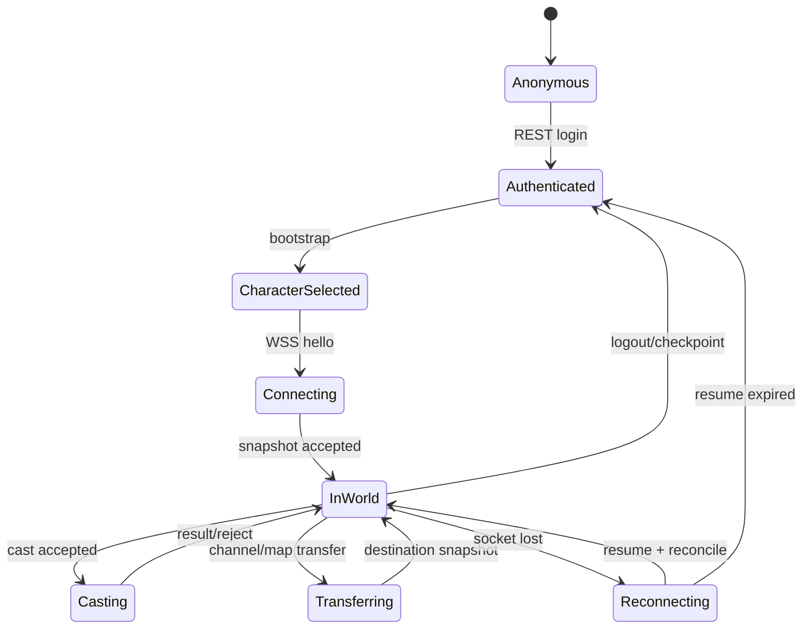
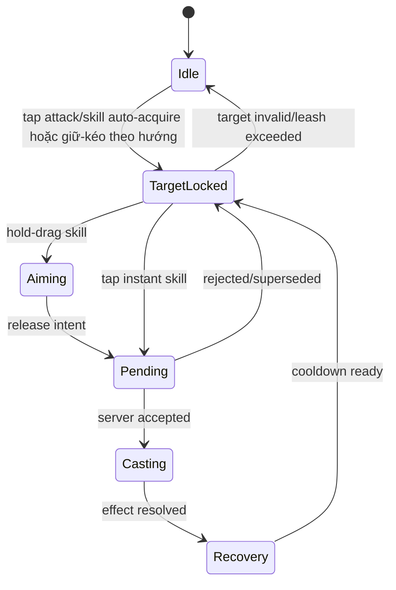
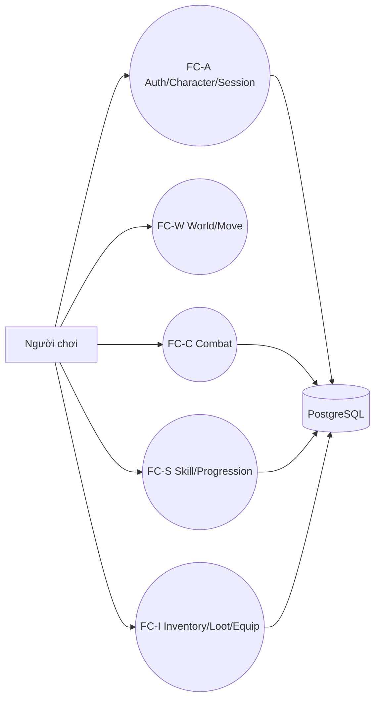
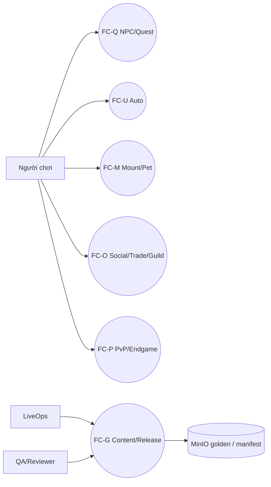

# Mô hình chức năng

## Sơ đồ chức năng

```mermaid
graph TD
  SYS[Port VLTK PC sang Mobile] --> A[FC-A Tài khoản - nhân vật - phiên]
  SYS --> W[FC-W Thế giới - di chuyển]
  SYS --> C[FC-C Combat - mục tiêu]
  SYS --> S[FC-S Skill - tiến triển]
  SYS --> I[FC-I Item - túi - trang bị - loot]
  SYS --> Q[FC-Q NPC - quest]
  SYS --> U[FC-U Tự tìm đường - tự đánh]
  SYS --> M[FC-M Thú cưỡi - pet]
  SYS --> O[FC-O Social - trade - guild]
  SYS --> P[FC-P PvP - endgame]
  SYS --> G[FC-G Content - evidence - release]
  A --> A1[Đăng ký/login/refresh/logout/reset]
  A --> A2[Tạo/xóa/restore/chọn nhân vật]
  A --> A3[Bootstrap/hello/resume/logout]
  C --> C1[Smart target/lock/aim]
  C --> C2[Cast 18 Hz/reconcile/replay]
  S --> S1[Shared + novice]
  S --> S2[242-row union 10 phái]
  I --> I1[60 ô/use/equip]
  I --> I2[Loot/shop/trade transaction]
  Q --> Q1[Talk/menu/Lua sandbox]
  Q --> Q2[Accept/progress/complete/reward]
  O --> O1[Chat/team]
  O --> O2[Trade/guild]
  P --> P1[PK/event/ladder]
```



### Sơ đồ trạng thái cốt lõi





## Ý nghĩa các chức năng

| **STT** | **Tên chức năng** | **Mô tả** |
| --- | --- | --- |
| 1 | FC-A Tài khoản, nhân vật, phiên | REST identity/bootstrap và lifecycle WSS, truy vết `FR-AUTH-001`, `FR-AUTH-002`, `FR-CHAR-001`, `FR-CHAR-002` và `FR-SESS-001`. |
| 2 | FC-W Thế giới, map, di chuyển | Map content, spawn, barrier, AOI, transfer và reconciliation. |
| 3 | FC-C Combat, mục tiêu | Tap nút attack/skill để auto-acquire, lock/aim, server-authoritative 18 Hz, deterministic replay. |
| 4 | FC-S Skill, tiến triển | Shared, novice và 242-row union 10 phái; học/nâng/cast; EXP/cấp 1-200. |
| 5 | FC-I Item, túi, trang bị, loot | 60 ô một-item-một-ô; loot/use/equip/shop; mutation transaction. |
| 6 | FC-Q NPC, quest | Tương tác NPC, Lua 5.1 sandbox, state/reward quest. |
| 7 | FC-U Tự động | Auto-path và auto-combat có hard leash, target/skill/loot policy. |
| 8 | FC-M Thú cưỡi, pet | Equip/mount modifier; companion lifecycle/skill/persistence. |
| 9 | FC-O Social, trade, guild | Chat, team, direct trade atomically, bang hội/RBAC. |
| 10 | FC-P PvP, endgame | PK mode/rule, event, ladder, boss/reward P4. |
| 11 | FC-G Content, evidence, release | Manifest pinned, validator, golden, migration/backup/rollback. |

# Sơ đồ sử dụng chức năng

## Người chơi: vòng đời P1



## Người chơi: mở rộng P2-P4



# Sơ đồ phân quyền sử dụng

| **Vai trò hệ thống** | **Chức năng hệ thống** | **Quyền (Admin, Add, Update, Delete, View)** |
| --- | --- | --- |
| Người chơi ẩn danh | Đăng ký, login, reset password | Add, View tự thân |
| Người chơi đã xác thực | Realm, character, bootstrap | Add, Update, Delete, View tự thân |
| Nhân vật đang online | Move, target, cast, interact, inventory, quest, social | Add command; Update/View state tự thân; không Admin |
| Đội viên | Team/chat/loot theo policy | Add, Update, View; rời đội |
| Đội trưởng | Team và PK-follow policy | Add, Update, Delete member, View |
| Thành viên bang | Guild/chat/event | View và action theo guild role |
| Bang chủ/quản lý | Thành viên và quyền bang | Add, Update, Delete, View trong bang; không DB Admin |
| LiveOps | Realm/release/backup/rollback | Admin theo runbook; không sửa economy trực tiếp |
| QA parity | Lab/replay/golden/validator | Add, Update, View evidence; không `PARITY_DONE` một mình |
| Reconciler | Source/content authority và contradiction | Admin manifest/ledger; reviewer bắt buộc |
| Dịch vụ game | Authoritative state/economy/quest | Admin nội bộ qua service identity; deny client direct DB |

# Sơ đồ luồng dữ liệu

## FC-A Tài khoản, nhân vật và phiên

### Đăng nhập, bootstrap và resume

| **TÊN THAO TÁC NGHIỆP VỤ** | FR-AUTH-002 + FR-SESS-001 |
| --- | --- |
| **Người dùng** | Người chơi, dịch vụ auth/game |
| **Thiết bị nhập** | Mobile REST client, WSS Protobuf client |
| **Thiết bị xuất** | Mobile UI, WSS event stream |
| **Bộ nhớ phụ** | PostgreSQL 16 cho session/revision durable; state realtime ở memory realm process |
| **D1** | Credential, realm, character, refresh token; hello/resume token, last snapshot/event revision |
| **D2** | Content manifest/version và trạng thái realm |
| **D3** | Account active, token valid, character ownership, realm available, protocol/content compatible |
| **D4** | Refresh/session metadata, login audit, checkpoint/revision |
| **D5** | Token/bootstrap; hello accepted/rejected; snapshot/delta/error ID |
| **D6** | Danh sách realm/nhân vật, tiến độ kết nối, lý do không resume |
| **Giải thuật** | B1: REST validate credential và issue token. B2: bootstrap trả character + pinned content. B3: WSS hello authorize account/character/version. B4: nếu resume window hợp lệ, replay/delta từ revision; nếu không, full snapshot. B5: client reconcile và chỉ vào `InWorld` khi snapshot accepted. |

### Tạo, xóa và khôi phục nhân vật

| **TÊN THAO TÁC NGHIỆP VỤ** | FR-CHAR-001/002 |
| --- | --- |
| **Người dùng** | Người chơi đã xác thực |
| **Thiết bị nhập** | Mobile REST client |
| **Thiết bị xuất** | Mobile character screen |
| **Bộ nhớ phụ** | PostgreSQL account/character/soft-delete audit |
| **D1** | `request_id`, realm, tên, giới tính, lựa chọn ban đầu; character ID khi delete/restore |
| **D2** | Name policy, starting content, soft-delete/restore window 7 ngày |
| **D3** | Ownership, unique name, tối đa 3 nhân vật active; restore chỉ khi còn slot, lifecycle transition hợp lệ |
| **D4** | Character base, initial inventory/skill/task, deleted_at/restore audit |
| **D5** | Character resource hoặc error registry ID |
| **D6** | Danh sách nhân vật và trạng thái có thể khôi phục |
| **Giải thuật** | B1: authorize. B2: validate request/content. B3: transaction tạo đầy đủ aggregate hoặc soft-delete/restore. B4: commit. B5: trả resource; retry cùng request không nhân đôi. |

## FC-W Thế giới, map và di chuyển

### Vào map, di chuyển và chuyển channel

| **TÊN THAO TÁC NGHIỆP VỤ** | FR-WORLD-001 + FR-MOVE-001/002 |
| --- | --- |
| **Người dùng** | Nhân vật online, dịch vụ realm/channel |
| **Thiết bị nhập** | Joystick mobile, destination auto-path, transfer request |
| **Thiết bị xuất** | World snapshot/delta, map loading và transfer state |
| **Bộ nhớ phụ** | Pinned map/barrier/nav content; PostgreSQL position/checkpoint/channel epoch |
| **D1** | Move intent, client tick/sequence, destination hoặc portal, expected channel epoch |
| **D2** | Map 53/canonical map content, barrier/nav, AOI, channel population và character state |
| **D3** | Session/character/realm hợp lệ, speed/barrier/range hợp lệ, channel admission và exactly-one-membership |
| **D4** | Authoritative position, map/channel/epoch và checkpoint revision |
| **D5** | Snapshot/delta, move correction, transfer prepare/commit/abort hoặc stable error |
| **D6** | Map/minimap, loading/transfer feedback và vị trí đã reconcile |
| **Giải thuật** | B1: resolve map ID và pinned content. B2: validate move intent ở tick 18 Hz. B3: cập nhật position/AOI theo thứ tự deterministic. B4: transfer dùng prepare-ticket-commit với epoch fencing. B5: checkpoint state committed; reconnect nhận đúng một channel membership. |

## FC-C Combat, mục tiêu và skill

### Chọn mục tiêu, aim và cast

| **TÊN THAO TÁC NGHIỆP VỤ** | FR-TGT-001/002 + FR-CBT-001/003/004 |
| --- | --- |
| **Người dùng** | Nhân vật online |
| **Thiết bị nhập** | Cảm ứng tap/hold-drag; WSS command |
| **Thiết bị xuất** | HUD target/aim; combat event/delta |
| **Bộ nhớ phụ** | Character skill/cooldown state, pinned skill content, replay log |
| **D1** | Attack/skill tap, lock flag, aim vector/point từ hold-drag, client sequence, command ID; không nhận target ID từ direct tap actor nhỏ |
| **D2** | World snapshot/AOI, skill manifest, server tick, deterministic RNG seed |
| **D3** | Actor alive/in-world, target valid/relation/range/LOS, cost/cooldown, latest-pending policy |
| **D4** | HP/MP/state/cooldown/aggro/loot delta và replay audit |
| **D5** | Command accepted/rejected; target/cast/combat/loot events; lifecycle recovery/fly/collide/vanish/status refresh/expire |
| **D6** | Target frame, aim preview, pending/casting/recovery, damage/state/error feedback |
| **Giải thuật** | B1: tap attack/skill tự chọn theo lock -> lệch hướng nhỏ nhất -> gần nhất; hold-drag magnetize trong cone, không tap actor nhỏ. B2: release tạo intent; local queue chỉ giữ pending mới nhất. B3: server nhận ở tick 18 Hz, authorize và validate. B4: tính integer/fixed-point + deterministic RNG. B5: commit state/economy nếu có. B6: phát event; client reconcile prediction. |

### Chạy Combat Parity Lab

| **TÊN THAO TÁC NGHIỆP VỤ** | OBJ-P0-001, NFR-PAR-001 |
| --- | --- |
| **Người dùng** | QA parity, Gameplay, reviewer |
| **Thiết bị nhập** | Fixture/corpus source; PC runtime capture `BLOCKED` |
| **Thiết bị xuất** | Validator, báo cáo replay/SSIM, evidence ledger |
| **Bộ nhớ phụ** | MinIO golden SHA-256; manifest case/source/content/tool revision |
| **D1** | Case ID, actor build, 5 NPC, skill/level, input sequence, tick/seed |
| **D2** | Static source/content và runtime golden khi có |
| **D3** | Shared + novice + 242-row union 10 phái đủ catalog; hash/locale/provenance pin; reviewer độc lập; PC runtime golden khi có, không suy từ static proof |
| **D4** | Actual event/state/frame sequence, diff, status và sign-off |
| **D5** | PASS/FAIL/BLOCKED; divergence đầu tiên; SSIM từng case |
| **D6** | Coverage dashboard; claim tối đa `SPECIFIED/FUNCTIONAL` khi thiếu runtime golden |
| **Giải thuật** | B1: khóa manifest. B2: chạy deterministic case. B3: so event/state logic 100%. B4: so frame SSIM >=0,99. B5: ghi evidence/contradiction. B6: chỉ reviewer ký mới cho phép `PARITY_DONE`; hiện live capture `BLOCKED`. |

## FC-S Skill và tiến triển

### Học, nâng skill và tăng cấp

| **TÊN THAO TÁC NGHIỆP VỤ** | FR-SKL-001/002/003 + FR-PROG-001/002 |
| --- | --- |
| **Người dùng** | Nhân vật online, Gameplay/Content và QA parity |
| **Thiết bị nhập** | Tap học/nâng skill, phân điểm, reward EXP và content version |
| **Thiết bị xuất** | Skill/progression delta, panel skill/nhân vật và combat availability |
| **Bộ nhớ phụ** | PostgreSQL character skill/stat/progression; catalog skill 114 cột và pinned release |
| **D1** | Skill ID/level/branch, point allocation, expected revision, reward source/idempotency key |
| **D2** | Skill tree/prerequisite/cost, level curve, class/phái và content release |
| **D3** | Prerequisite, max level, điểm/tiền đủ, cùng phái/release, reward chưa nhận |
| **D4** | Skill level, remaining point, EXP/level/stat và audit/revision |
| **D5** | Business result sau commit, skill/progression delta hoặc stable error |
| **D6** | Icon/SPR PC, level/cost/prerequisite, điểm còn lại và trạng thái có thể học/nâng |
| **Giải thuật** | B1: authorize và khóa character aggregate. B2: đọc rule từ release đã pin. B3: validate prerequisite/cost/revision. B4: transaction mutation + audit/idempotency. B5: commit rồi ACK/delta. B6: skill chỉ được dùng khi state committed và combat validator chấp nhận. |

## FC-I Item, túi, trang bị và economy

### Nhặt, dùng, mặc/tháo và mua/bán

| **TÊN THAO TÁC NGHIỆP VỤ** | FR-ITEM-001, FR-INV-001/002, FR-EQP-001, FR-SHOP-001 |
| --- | --- |
| **Người dùng** | Nhân vật online |
| **Thiết bị nhập** | Tap loot/item/action sheet; WSS mutation command |
| **Thiết bị xuất** | Inventory/equipment/loot HUD, business result |
| **Bộ nhớ phụ** | PostgreSQL item instance, 60 slot, equipment, money, audit/idempotency |
| **D1** | Idempotency key, expected revision, operation, item instance/slot/quantity/shop |
| **D2** | Loot owner/expiry, item/equipment/shop content, combat state |
| **D3** | Ownership, một item/một ô, 60 ô, slot/level/phái, đủ tiền, combat mutation lock |
| **D4** | Slot/equipment/item/money revision và audit transaction |
| **D5** | Business success sau commit hoặc stable error; inventory/equipment delta |
| **D6** | 60 ô, action khả dụng, compare stat, tiền và nguyên nhân reject |
| **Giải thuật** | B1: authorize actor/idempotency. B2: lock aggregate và validate expected revision. B3: validate QD-INV/ECO. B4: mutate trong một PostgreSQL transaction. B5: commit. B6: lưu result idempotent và mới phát business ACK/delta. |

### Giao dịch trực tiếp hai người chơi

| **TÊN THAO TÁC NGHIỆP VỤ** | FR-TRD-001 |
| --- | --- |
| **Người dùng** | Hai nhân vật online |
| **Thiết bị nhập** | Offer/lock/confirm/cancel commands |
| **Thiết bị xuất** | Trade sheet và result cho cả hai |
| **Bộ nhớ phụ** | PostgreSQL trade session, item/money, audit/idempotency |
| **D1** | Trade ID, participant, offered item/money, revision, confirm token |
| **D2** | Current inventory/money/connectivity |
| **D3** | Cùng trade, owner hợp lệ, item không lock-trade, đủ ô/tiền, cả hai confirm cùng revision |
| **D4** | Atomic ownership/slot/money transfer hoặc không thay đổi; final audit |
| **D5** | Final success/cancel/conflict sau commit |
| **D6** | Offer hai phía, lock/confirm state, error |
| **Giải thuật** | B1: tạo session. B2: mỗi thay đổi offer vô hiệu confirm. B3: lock đóng offer. B4: hai confirm cùng revision. B5: transaction khóa hai aggregate theo thứ tự ổn định, validate lại, chuyển và commit. B6: phát kết quả. |

## FC-Q NPC và quest

### Tương tác NPC và hoàn tất quest

| **TÊN THAO TÁC NGHIỆP VỤ** | FR-NPC-001 + FR-QST-001 |
| --- | --- |
| **Người dùng** | Nhân vật online |
| **Thiết bị nhập** | Target/interact/menu choice/quest command |
| **Thiết bị xuất** | Dialogue/menu/tracker/reward result |
| **Bộ nhớ phụ** | PostgreSQL quest state/idempotency; Lua 5.1 script + content manifest |
| **D1** | NPC ID, interaction ID, menu choice, quest ID/action |
| **D2** | NPC/quest/script content, world and character state |
| **D3** | Range/LOS, NPC active, quest transition/prerequisite, Lua host whitelist, reward unclaimed |
| **D4** | Quest state/progress, item/EXP/money reward, script audit |
| **D5** | Dialogue/menu, quest/reward event hoặc stable error |
| **D6** | Localized Vietnamese text, objective progress, reward preview/result |
| **Giải thuật** | B1: validate interaction. B2: execute pinned Lua in sandbox budget. B3: host API only emits validated intents. B4: transaction transition + reward once. B5: commit then result. |

## FC-U Tự động

### Auto-path và auto-combat

| **TÊN THAO TÁC NGHIỆP VỤ** | FR-PATH-001 + FR-AUTO-001/002 |
| --- | --- |
| **Người dùng** | Nhân vật online |
| **Thiết bị nhập** | Destination/NPC/quest objective; preset, leash center/radius, skill/heal/loot filters |
| **Thiết bị xuất** | Movement/cast intents và auto-state HUD |
| **Bộ nhớ phụ** | Pinned map/nav content; player preference; authoritative world state |
| **D1** | Destination/preset/start-stop; hard leash and filters |
| **D2** | Barrier/nav, AOI targets/objects, HP/MP/cooldown/inventory |
| **D3** | Route exists, destination authorized, target inside hard leash, action valid như manual |
| **D4** | Chỉ preference/checkpoint; gameplay state do normal command handlers lưu |
| **D5** | Path/cast/pick intents, stop reason |
| **D6** | Route, leash, target, active skill, warning túi đầy/no-path |
| **Giải thuật** | B1: auto-path resolve destination; joystick/manual cast/combat/no-route/transfer hủy và không tự resume. B2: auto-combat neo tại điểm bật, scan trong hard leash và dùng cùng target policy. B3: manual cast pause tới hết recovery rồi resume scan nếu còn trong leash. B4: leash breach luôn return-to-anchor; no-target giữ scanning. B5: toggle/death/disconnect/transfer/túi đầy là terminal stop. B6: mọi intent qua server validation. |

## FC-M Thú cưỡi và pet

### Trang bị thú cưỡi và điều khiển pet

| **TÊN THAO TÁC NGHIỆP VỤ** | FR-MNT-001 + FR-PET-001 |
| --- | --- |
| **Người dùng** | Nhân vật online |
| **Thiết bị nhập** | Tap equip/mount/dismount/summon/recall và chọn skill pet |
| **Thiết bị xuất** | Avatar/SPR, stat delta, companion state và stable error |
| **Bộ nhớ phụ** | PostgreSQL ownership/equip/level/state; pinned mount/pet/avatar content |
| **D1** | Instance ID, action, expected revision, target/skill intent nếu pet chiến đấu |
| **D2** | Ownership, class/level rule, map/combat restriction, stat/visual content |
| **D3** | Owner và item active, chỉ một mount/pet active, transition hợp lệ, cùng realm/release |
| **D4** | Equip/active state, progression, cooldown/stat modifier và checkpoint revision |
| **D5** | Mutation result sau commit; avatar/companion delta hoặc reject reason |
| **D6** | Panel tap-action, icon/SPR PC, compare stat và trạng thái active |
| **Giải thuật** | B1: authorize/lock aggregate. B2: validate ownership/rule/revision. B3: atomically deactivate current và activate requested instance. B4: commit/checkpoint. B5: broadcast visual/stat delta; pet combat vẫn đi qua target/skill server-authoritative. |

## FC-O Social, bang hội và PvP

### Tổ đội, bang hội và đổi trạng thái PK

| **TÊN THAO TÁC NGHIỆP VỤ** | FR-TEAM-001 + FR-GUILD-001 + FR-PVP-001 |
| --- | --- |
| **Người dùng** | Người chơi, đội trưởng, quản lý bang |
| **Thiết bị nhập** | Create/invite/reply/leave/kick; guild action; PK mode request |
| **Thiết bị xuất** | Roster, guild view, PK state/result |
| **Bộ nhớ phụ** | PostgreSQL membership/role/guild/PK audit; realtime presence |
| **D1** | Target character, action, expected revision, desired PK mode |
| **D2** | Membership/role/presence, map/event rule, cooldown/PK value |
| **D3** | Permission, channel soft cap 150/hard cap 200, mutually exclusive membership, captain-follow and guild-war constraints |
| **D4** | Team/guild membership and PK state/audit |
| **D5** | Roster/state delta hoặc error |
| **D6** | Invite/context sheet, roster/role, cooldown và mode hiện tại |
| **Giải thuật** | B1: authorize actor/role. B2: validate target và revision. B3: với PK áp dụng map, cooldown, team/guild rule. B4: transaction khi persistent. B5: broadcast delta theo membership/AOI. |

## FC-P PvP và endgame

### Tham gia event, ladder và nhận reward

| **TÊN THAO TÁC NGHIỆP VỤ** | FR-PVP-002 + FR-END-001 |
| --- | --- |
| **Người dùng** | Người chơi/đội/bang, LiveOps và QA |
| **Thiết bị nhập** | Enroll/leave, combat intents, event schedule/content release |
| **Thiết bị xuất** | Event state, score/rank, boss/reward/rebirth result |
| **Bộ nhớ phụ** | PostgreSQL event/participant/ladder/reward/rebirth; pinned rule content |
| **D1** | Event ID, participant/party, action, expected revision và idempotency key |
| **D2** | Schedule, admission/capacity, PK/boss/scoring/tie-break/reward rule |
| **D3** | Event active, eligibility/capacity, exactly-one enrollment, reward chưa grant |
| **D4** | Participant state, score/rank, reward grant, rebirth/checkpoint và audit |
| **D5** | Enroll/state/ladder/reward delta sau commit hoặc stable error |
| **D6** | Event panel, timer, score/rank/reward preview và result |
| **Giải thuật** | B1: validate signed schedule/release và admission. B2: pin participant epoch. B3: combat/scoring deterministic theo server tick. B4: kết thúc bằng tie-break stable. B5: transaction state + reward once + outbox. B6: commit rồi phát result/ladder. |

## FC-G Content, evidence và release

### Publish, activate, rollback và chứng minh parity

| **TÊN THAO TÁC NGHIỆP VỤ** | NFR-CONT-001 + NFR-PAR-001 + GATE-G0, GATE-G1, GATE-G2, GATE-G3, GATE-G4, GATE-G5, GATE-G6 |
| --- | --- |
| **Người dùng** | Reconciler, Content, QA parity, LiveOps/SRE và reviewer |
| **Thiết bị nhập** | Source snapshot, catalog/manifest ký, test result và golden SHA-256 |
| **Thiết bị xuất** | Immutable release, gate report, activation/rollback audit |
| **Bộ nhớ phụ** | PostgreSQL content metadata; MinIO artifact/golden; registry evidence/trace |
| **D1** | Snapshot/tool revision, artifact provenance/hash/locale, reviewer và release command |
| **D2** | Source-authority, lifecycle, trace closure, contract/test/golden policy |
| **D3** | Schema/hash/signature hợp lệ, first-match winner resolved, test/golden PASS, không open blocker |
| **D4** | Release/activation state, gate result, audit, rollback pointer và evidence revision |
| **D5** | Publish/activate/rollback result hoặc blocker machine-readable |
| **D6** | Coverage/gate dashboard, diff, owner và exit criteria của blocker |
| **Giải thuật** | B1: census và resolve source không bịa. B2: validate schema/provenance/signature. B3: chạy G0-G6 tuần tự. B4: transaction activate một release/realm, không hot reload. B5: monitor; lỗi thì rollback pointer/binary tương thích. B6: chỉ nâng parity khi live PC golden và reviewer cùng revision. |

# Sơ đồ khai thác hệ thống

## Cách thức triển khai

Ứng dụng là mobile app Unity qua WAN. Production dùng REST FastAPI cho đăng ký/login, role/character, map và movement ở slice hiện tại; realtime Python là seam tiếp theo và chưa được tuyên bố hoàn tất. Bootstrap/realtime tương lai phải pin exact content digest và runtime skill policy (`vltktool`, không filesystem fallback, không claim runtime parity khi golden còn `BLOCKED`). Backend mục tiêu là Python 3 + FastAPI modular monolith trong `backend/`, một deployment cho mỗi realm ban đầu; PostgreSQL 16 là CSDL production duy nhất và tập trung theo realm/deployment. MinIO giữ artifact/golden có SHA-256, không nằm trên đường authoritative gameplay. Lua 5.1 chạy trong sandbox qua host API whitelist khi được port. C# mock/catalog cũ chỉ DevHarness, production không fallback.

Realm đầu tiên dùng một process, availability 99,5%, RPO 5 phút, RTO 60 phút; TLS ingress, PostgreSQL session durable, reconnect grace 15 giây và backup/WAL/restore drill là bắt buộc. Mọi bundle production immutable và pin version/hash/locale/provenance.

## Sơ đồ triển khai

```mermaid
graph TB
  subgraph Device[Android 4 GB+]
    APP[Unity Mobile Client]
    CACHE[Content cache pinned]
    APP --- CACHE
  end
    EDGE[TLS Ingress / Load Balancer]
    subgraph Realm[Python backend deployment]
      REST[FastAPI REST Auth/Role/Map]
      WSS[Python realtime seam\nCHƯA TRIỂN KHAI]
    MOD[Domain modules\nworld/combat/item/quest/social]
    LUA[Lua 5.1 sandbox]
    REST --> MOD
    WSS --> MOD
    MOD --> LUA
  end
  DB[(PostgreSQL 16)]
  OBJ[(MinIO content/golden)]
    OBS[Metrics/log/trace\nBLOCKED [CẦN XÁC NHẬN]\nOwner SRE; exit: retention policy approved]
  APP -->|HTTPS/WSS WAN| EDGE
  EDGE --> REST
  EDGE --> WSS
  MOD -->|transaction| DB
  APP -->|version/hash fetch| OBJ
  MOD -->|manifest read| OBJ
  Realm --> OBS
```
