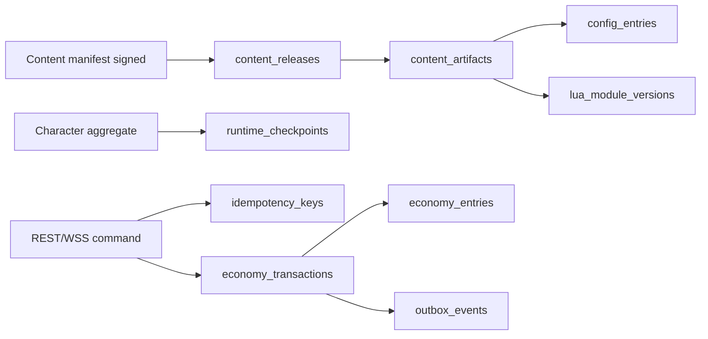

```mermaid
erDiagram
    REALMS ||--o{ ACCOUNTS : contains
    REALMS ||--o{ CONTENT_RELEASES : publishes
    ACCOUNTS ||--o{ AUTH_SESSIONS : opens
    AUTH_SESSIONS ||--o{ ADMISSION_TICKETS : issues
    ACCOUNTS ||--o{ CHARACTERS : owns
    CHARACTERS ||--|| CHARACTER_STATS : has
    CHARACTERS ||--|| CHARACTER_POSITIONS : has
    CHARACTERS ||--o{ CHARACTER_SKILLS : learns
    CHARACTERS ||--o{ INVENTORY_ITEMS : stores
    CHARACTERS ||--o{ RUNTIME_CHECKPOINTS : checkpoints
    REALMS ||--o{ WALLETS : scopes
    ECONOMY_TRANSACTIONS ||--|{ ECONOMY_ENTRIES : posts
    WALLETS ||--o{ ECONOMY_ENTRIES : records
    CONTENT_RELEASES ||--|{ CONTENT_ARTIFACTS : includes
    CONTENT_ARTIFACTS ||--o{ CONFIG_ENTRIES : proves
    LUA_MODULES ||--o{ LUA_MODULE_VERSIONS : versions
    CONTENT_ARTIFACTS ||--o{ LUA_MODULE_VERSIONS : proves
    CONTENT_RELEASES ||--o{ LUA_MODULE_VERSIONS : pins
    REALMS ||--o{ OUTBOX_EVENTS : emits
    REALMS ||--o{ IDEMPOTENCY_KEYS : deduplicates
    REALMS ||--o{ AUDIT_EVENTS : audits
    ACCOUNTS ||--o{ PASSWORD_RESET_TOKENS : resets
    REALMS ||--o{ WORLD_CHANNELS : hosts
    CHARACTERS ||--o{ CHARACTER_TRANSFERS : transfers
    CHARACTERS ||--o{ CHARACTER_QUESTS : progresses
    CHARACTER_QUESTS ||--o{ QUEST_OBJECTIVES : contains
    CHARACTERS ||--o{ REWARD_GRANTS : receives
    PARTIES ||--o{ PARTY_MEMBERS : contains
    CHARACTERS ||--o{ FRIENDSHIPS : connects
    CHARACTERS ||--o{ CHAT_MESSAGES : sends
    TRADES ||--o{ TRADE_ITEMS : escrows
    STALLS ||--o{ STALL_LISTINGS : lists
    GUILDS ||--o{ GUILD_MEMBERS : contains
    CHARACTERS ||--o{ CHARACTER_MOUNTS : owns
    CHARACTERS ||--o{ CHARACTER_PETS : owns
    PVP_SEASONS ||--o{ PVP_LADDER_ENTRIES : ranks
    GAME_EVENTS ||--o{ EVENT_PARTICIPANTS : enrolls
    CHARACTERS ||--o{ CHARACTER_REBIRTHS : records
```

# Thiết kế dữ liệu với tính đúng đắn

| Thuộc tính | Giá trị |
| --- | --- |
| Sản phẩm | VLTK Mobile Production Python/FastAPI Runtime |
| Pha CNPM | Pha 3 - Thiết kế dữ liệu |
| CSDL đích | PostgreSQL 16 trong `/var/www/tt-docker`, database/role/migration riêng |
| Contract normative | `contracts/sql/game.v1.sql` |
| Data dictionary field-level | [`domains/server-runtime/postgresql-data-dictionary.md`](domains/server-runtime/postgresql-data-dictionary.md) - 48/48 bảng, 528/528 cột từ SQL normative |
| Cập nhật | 2026-07-20 |
| Trạng thái | Schema production coverage P1-P4; catalog gameplay chưa có evidence tiếp tục `BLOCKED` |

Tài liệu này áp dụng phương pháp pha 3: dữ liệu được suy từ luồng auth,
bootstrap, character và game realtime; sau đó bổ sung cấu trúc tiến hóa,
truy xuất, bảo mật và an toàn. SQL contract là nguồn chân lý field-level; ERD
và bảng dưới đây giải thích ngữ nghĩa và truy vết.

## Nguồn và giả định có bằng chứng

| Claim | Bằng chứng hiện trạng | Quyết định đích |
| --- | --- | --- |
| Client có facade mock/REST | `Assets/Scripts/Backend/BackendClient.cs:35-53` | Adapter Unity có thể thay thế, mock không là contract production |
| Legacy login không có token, dùng `accName` | `Dto/AccountDto.cs:73-83` | JWT access + refresh rotation; account lấy từ principal |
| Role và player state tách, ID integer | `Dto/RoleDto.cs:28-49`, `Dto/PlayerDto.cs:35-50` | Character UUID; giữ `legacy_role_id` để migrate |
| Movement legacy gửi tọa độ client | `RestGameBackend.cs:146-183` | WSS nhận movement intent; server xác nhận position ở tick 18 Hz |
| Cast production phải server-authoritative | `Dto/SkillDto.cs:207-300` | Client chỉ gửi skill/target; state/cooldown lấy ở server |
| Content hiện có source path/package/uid/encoding/tool | `Core/SourceEvidence.cs:10-52`, `Model/SourceAssetId.cs:36-49` | Artifact immutable có hash, parser version và provenance |
| Lua bridge load source theo script ID/version | `Sandbox/LuaScriptBridge.cs:57-172` | Lua module/version pin vào content release, có approval/sandbox policy |

## Xác định các bảng

| Nhóm/luồng | Bảng ghi | Bảng đọc | Yêu cầu đúng đắn |
| --- | --- | --- | --- |
| Login/refresh/logout | `accounts`, `auth_sessions`, `audit_events` | `realms`, `accounts` | Không lộ tồn tại account; token hash, rotation/revoke |
| Bootstrap/admission | `admission_tickets`, `auth_sessions`, `idempotency_keys` | `realms`, `content_releases`, `characters` | Ticket hash một lần bind cùng account owner với auth session và character, cùng realm/release, epoch và grace 15 giây |
| Tạo/chọn/xóa character | `characters`, `character_stats`, `character_positions`, `wallets`, `runtime_checkpoints`, `outbox_events` | `accounts`, content config | Tạo aggregate atomic; soft-delete; optimistic version |
| Simulation 18 Hz | `runtime_checkpoints` theo chu kỳ/disconnect | position/stats/skill/item khi hydrate | Input ordered theo epoch/seq, snapshot có baseline/checksum |
| Inventory/skill | `inventory_items`, `character_skills` | config/content release | Item instance UUID; template nghĩa đúng release |
| Economy | `economy_transactions`, `economy_entries`, `wallets`, `outbox_events` | wallet | Double-entry cân bằng, bất biến, reversal, idempotent |
| Publish config/Lua | `content_releases`, `content_artifacts`, `config_entries`, `lua_modules`, `lua_module_versions` | provenance/source | Manifest ký, digest đúng, release immutable |
| Vận hành/audit | `idempotency_keys`, `outbox_events`, `audit_events` | aggregate metadata | Replay an toàn, publish at-least-once, audit append-only |
| Email/reset | `accounts`, `password_reset_tokens` | account lookup HMAC | Không lưu email/token thô; reset single-use, expiry, revoke session |
| Channel/transfer P2 | `world_channels`, `character_transfers` | character/party/channel | Một transfer prepared/character; freeze command; commit tick rõ |
| Quest P1-P2 | `character_quests`, `quest_objectives`, `reward_grants` | content release, economy | Transition hợp lệ; reward exactly-once |
| Party/friend/chat P2-P3 | `parties`, `party_members`, `party_invites`, `friendships`, `chat_messages`, `chat_reports` | character/channel | Một party active; invite expiry; report dedupe/moderation |
| Trade/stall P3 | `trades`, `trade_items`, `trade_currency_offers`, `stalls`, `stall_listings` | inventory/wallet/channel | Offer đổi làm tăng revision; hai confirm cùng revision; escrow atomic |
| Guild P3 | `guilds`, `guild_members` | character/wallet | Một guild active/character; một leader; RBAC server-side |
| Mount/pet P2-P3 | `character_mounts`, `character_pets` | inventory/content | Ownership duy nhất; một mount equipped/riding; pet server-authoritative |
| PvP/event/rebirth P4 | `character_pvp_profiles`, `pvp_seasons`, `pvp_ladder_entries`, `game_events`, `event_participants`, `character_rebirths` | content/reward/economy | Season/version; participant unique; reward/rebirth idempotent |

Mọi bảng tenant/gameplay có `realm_id NOT NULL`. Mọi tham chiếu giữa bảng
tenant dùng composite FK `(realm_id, foreign_id) -> (realm_id, id)`, vì vậy
không thể liên kết account/character/wallet/content xuyên realm dù UUID hợp lệ.
`realms` là root duy nhất không có `realm_id`. Riêng admission dùng FK ba cột
`(realm_id, auth_session_id, account_id)` và
`(realm_id, character_id, account_id)`; các FK rời hợp lệ không đủ chứng minh
session và character thuộc cùng account.

## Sơ đồ ERD

## Chi tiết các bảng

Quy ước chung: UUID dùng `gen_random_uuid()`; timestamp là UTC
`timestamptz`; aggregate mutable có `version bigint > 0`; `created_at` không
được sửa. Các nhóm field trong một ô đều là cột riêng trong SQL normative.

| Bảng | Field và kiểu chính | Khóa / ràng buộc | Index và ngữ nghĩa |
| --- | --- | --- | --- |
| `realms` | `id uuid`, `code citext`, `name text`, `status text`, `active_content_release_id uuid`, timestamps, `version bigint` | PK `id`; UQ `code`; status `open/maintenance/closed`; active release cùng realm | lookup `code`; root admission/content |
| `accounts` | `id`, `realm_id`, `account_name citext`, password hash, email ciphertext/HMAC/verified time, encrypted OTP, status, soft-delete/version | PK `id`; tên dài `3..32`; FK realm; partial UQ active name và email HMAC | Cùng miền với Register/Login OpenAPI; email lookup không giải mã; password chỉ hash Argon2id; tham số runtime đang `BLOCKED [CẦN XÁC NHẬN]` tại mục Điểm cần xác nhận |
| `auth_sessions` | `id`, realm/account, `refresh_token_id`, SHA-256 token hash, family/device, issue/expiry/rotate/revoke timestamps | Composite FK account; candidate key `(realm,id,account)`; UQ token ID; expiry > issue | live session theo realm/account/expiry; family để detect replay |
| `characters` | UUID, realm/account, `character_slot 1..3`, legacy ID, name, gender, homeland, faction/series/level, appearance, delete/purge/version | candidate key `(realm,id,account)`; partial UQ active `(realm,account,slot)` loại race giới hạn 3; level `1..200` | list active theo account; purge 7 ngày; giữ tên trong cửa sổ |
| `admission_tickets` | UUID, realm/session/account/character/release, ticket hash, protocol, epoch, issue/expiry/consume/revoke, grace | FK ba cột chứng minh session và character cùng account; hash unique; một ticket outstanding/account; grace 15 giây | Bootstrap `POST` chọn character; consume atomic trước WSS admission; không lưu raw ticket |
| `character_stats` | realm/character, exp, trans-life, points, four stats, repute, current life/mana/stamina, version | PK/FK `(realm_id,character_id)`; số không âm | PK cover get character; tiền không nằm ở đây |
| `character_positions` | realm/character, `map_id`, integer x/y, facing milliradian, server tick, version | PK/FK character; map/tick không âm | `(realm_id,map_id)` cho hydrate/ops; chỉ server ghi |
| `character_skills` | UUID, realm/character, `skill_id`, level, active, `last_cast_tick`, timestamps/version | UQ character+skill; positive ID/level; composite FK | partial active skills; content giải nghĩa skill ID |
| `inventory_items` | UUID, realm/character, template/release, container/slot/quantity, durability, attributes JSON, bound, soft-delete/version | quantity > 0; container allowlist; partial UQ active slot | character+template active; delete là tombstone, không hard-delete trực tiếp |
| `wallets` | UUID, realm, owner type/id, currency, balance/version | UQ owner+currency; currency stable uppercase; owner type allowlist | owner lookup; balance cache chỉ đổi cùng ledger transaction |
| `economy_transactions` | UUID, realm, operation/idempotency, actor, status, reversal, metadata, `created_at/posted_at/reversed_at` | UQ `(realm,operation,key)`; insert bắt buộc `pending`; chỉ `pending->posted/failed`, `posted->reversed`; timestamp phải khớp state | Payload bất biến từ lúc tạo; `posted` chỉ sau ledger cân bằng; reversal là transaction đối ứng |
| `economy_entries` | UUID, realm, transaction/wallet, currency, signed delta, balance-after, entry index | composite FK; delta != 0; UQ tx/index; deferred sum(delta)=0 mỗi currency | wallet history theo descending time; append-only |
| `runtime_checkpoints` | UUID, realm/character, epoch/tick/client seq, schema version, Protobuf blob + SHA-256, superseded timestamp | UQ character+epoch+tick; một checkpoint current; composite FK | current partial UQ; history descending tick; verify hash trước hydrate |
| `idempotency_keys` | UUID, realm/actor/operation/key, request hash, state, cached response, expiry | UQ scope/key; request hash 32 bytes; status allowlist | expiry cleanup; response không chứa secret/token login |
| `outbox_events` | UUID event ID, realm, aggregate identity/version, event/schema type, payload, schedule/attempt/publish | UQ aggregate version+event type; JSON object | pending partial index; append in same aggregate transaction |
| `content_releases` | UUID, realm, version, locale `vi`, hot-reload `false`, source snapshot ID/root/tree hash/generator revision, Lua 5.1 policy+whitelist hash, manifest/content digest, 242-row union hash, runtime skill policy, signature/key, lifecycle | UQ realm+version/hash; candidate key release+snapshot; một active release/realm | partial active release; immutable khi active/retired; manifest top-level và SQL cùng provenance; policy dùng `vltktool`, cấm filesystem fallback và không claim runtime parity |
| `content_artifacts` | UUID, realm/release/snapshot, logical path/kind/media/encoding/size/hash/URI, source path hoặc package+UID, encoding/tool/query/note, parser/digest | UQ release+path; FK `(realm,release,snapshot)`; parser/tool/source bắt buộc; digest 32 bytes | Không ghép artifact từ snapshot khác; SPR fallback giữ frame PC, text Việt runtime và attachment/debt |
| `config_entries` | UUID, realm/release/artifact, namespace/key, JSON value/hash/source line | UQ release+namespace+key; FK `(realm,artifact,release)` | Artifact provenance bắt buộc thuộc chính release của config; raw source không bị value JSON thay thế |
| `lua_modules` | UUID, realm, stable module key, retire time | UQ module key/realm | stable identity qua release |
| `lua_module_versions` | UUID, realm/module/release/artifact, source/bytecode digests, Lua `5.1`, sandbox và host-API-whitelist hash, deterministic, approval | UQ module+release; FK `(realm,artifact,release)` và FK policy/hash vào release; whitelist/approval bắt buộc | Không ghép source hoặc whitelist release khác; API ngoài whitelist fail closed; chưa approved không activate |
| `audit_events` | UUID, realm, actor/action/target, request/trace, before/after hashes, metadata/time | Append-only; actor type allowlist | target/actor timelines; không lưu password/token/payload PII thô |
| `password_reset_tokens` | realm/account, token SHA-256, request/expiry/consume, IP hash | UQ realm+hash; expiry > request; composite FK | live token theo account/expiry; raw OTP/token không lưu |
| `world_channels` | realm/map/channel/status/capacity/population/endpoint/version | UQ realm+map+channel; population <= capacity | admission theo realm/map/status/population |
| `character_transfers` | realm/character, source/destination channel, party, state/ticks/token hash/expiry | một prepared/character; source != destination; composite FKs | resume/cutover theo token hash, giữ party affinity |
| `character_quests` | realm/character, quest/content IDs, state/timestamps/revision | UQ character+quest; state allowlist; composite FKs | active quest theo character/state |
| `quest_objectives` | quest-state FK, objective key, current/target/time | UQ quest+key; `0 <= current <= target` | delta objective chính xác |
| `reward_grants` | character, source type/id, reward key, ledger tx, status/time | UQ source+character+reward; composite FKs | exactly-once cho quest/event/PvP/boss/rebirth |
| `parties` | captain, loot policy, state/time/version | composite captain FK; policy/state allowlist | root roster và transfer affinity |
| `party_members` | party/character, role, join/leave | partial UQ active character và captain | một party active/character |
| `party_invites` | party, inviter/invitee, state/expiry/response | pending UQ; inviter != invitee; expiry > create | retry/expiry idempotent |
| `friendships` | ordered character pair, directional state, timestamps | UQ canonical pair; low UUID < high UUID | query index cho cả hai đầu |
| `chat_messages` | sender/channel/ref/recipient, encrypted body/hash, moderation/time | channel/state allowlist; composite character FKs | channel timeline; body không ở log |
| `chat_reports` | message/reporter/reason/encrypted note/status/time | UQ message+reporter | moderation queue theo state/time |
| `trades` | two characters, state/revision/two confirms/ledger tx/expiry | participants khác nhau; composite FKs | participant/state indexes; ACK sau commit |
| `trade_items` | trade/offerer/item/quantity/revision | UQ trade+item; composite escrow FKs | offer change invalidates confirms |
| `trade_currency_offers` | trade/offerer/currency/amount/revision | amount > 0; UQ offerer+currency/trade | ledger post atomic |
| `stalls` | owner/channel/name/state/time/version | partial UQ one open/owner | channel ownership và lifecycle |
| `stall_listings` | stall/item/quantity/currency/price/remaining/state/expiry | UQ stall+item; remaining <= quantity | partial search state/currency/price |
| `guilds` | realm/name/leader/level/notice/state/version | partial UQ active name; composite leader FK | stable guild root |
| `guild_members` | guild/character/role/permission/contribution/cooldown | partial UQ active character/leader | RBAC và membership persistent |
| `character_mounts` | character/template/release/source item/level/exp/equipped/riding/version | partial UQ equipped và riding/character | modifier server-side, content pin |
| `character_pets` | character/template/release/name/level/exp/mode/active/state/version | mode allowlist; composite FKs | summon/follow persistence |
| `character_pvp_profiles` | character, PK mode/value/change/cooldown/version | PK character; mode allowlist; value >= 0 | server validates mode/cooldown |
| `pvp_seasons` | season/release/window/state | UQ key; ends > starts | versioned ladder boundary |
| `pvp_ladder_entries` | season/character/rating/wins/losses/rank/version | UQ season+character | rating/rank rebuild index |
| `game_events` | key/type/release/window/state/checkpoint/version | UQ key+start; ends > starts | schedule/state index; durable checkpoint |
| `event_participants` | event/character/state/score/rank/contribution/time | UQ event+character | deterministic ranking index |
| `character_rebirths` | character/ordinal/release/levels/reward/hash/time | UQ character+ordinal; levels `1..200` | append-only rebirth audit |

Ràng buộc không thể biểu diễn thuần row CHECK (wallet owner tồn tại đúng bảng,
content artifact bất biến sau activate, balance-after khớp entry trước) phải được
enforce trong application transaction và contract test. Không dùng trigger để
âm thầm thực thi gameplay; trigger deferred chỉ chặn ledger posted mất cân bằng.

### Bảng thuộc tính chuẩn P2-P4

SQL normative liệt kê đầy đủ từng cột. Bảng dưới giữ đúng cột của template CNPM
cho các thuộc tính xuyên aggregate và thuộc tính quyết định invariant mới.
Data dictionary field-level của toàn bộ 48 bảng/528 cột, gồm kiểu, độ rộng,
nullability/default, khóa/ràng buộc và diễn giải, nằm tại
[`domains/server-runtime/postgresql-data-dictionary.md`](domains/server-runtime/postgresql-data-dictionary.md).
Shard đó được sinh trực tiếp từ `contracts/sql/game.v1.sql`; khi khác biệt, SQL
normative thắng và dictionary phải được tái sinh/review trong cùng thay đổi.

| **TT** | **Tên thuộc tính (Field name)** | **Kiểu dữ liệu** | **Độ rộng** | **Not NULL** | **Ràng buộc / Miền giá trị** | **Diễn giải** |
| --- | --- | --- | --- | --- | --- | --- |
| 1 | `realm_id` | `uuid` | 16 byte | Có | Composite FK cùng mọi ID tenant | Chặn liên kết xuyên realm |
| 2 | `email_lookup_hmac` | `bytea` | 32 byte | Không | Partial UQ active account/realm | Lookup email không giải mã |
| 3 | `token_hash` | `bytea` | 32 byte | Có | UQ realm; expiry; single-use | Reset token/OTP không lưu thô |
| 4 | `gender` | `text` | 6 | Có | `male`, `female` | Khớp REST character contract |
| 5 | `homeland_id` | `integer` | 4 byte | Có | `> 0`, content-backed | Quê quán nhân vật |
| 6 | `state` | `text` | Theo bảng | Có | CHECK allowlist từng aggregate | State machine không dùng string tự do |
| 7 | `revision`/`version` | `bigint` | 8 byte | Có | `> 0`, optimistic concurrency | Confirm trade/command phải cùng revision |
| 8 | `content_release_id` | `uuid` | 16 byte | Có khi dùng template | Composite FK release cùng realm | Pin quest/mount/pet/PvP/event rule |
| 9 | `reward_key` | `text` | <= 128 ký tự app | Có | UQ source+character+key | Reward exactly-once |
| 10 | `score`/`rating` | `bigint` | 8 byte | Có | Server-only; stable tie-break character UUID | Event/ladder rebuild deterministic |
| 11 | `source_snapshot_id` | `text` | 7..128 | Có | Candidate key cùng release; artifact FK đúng snapshot | Không trộn hai lần chụp source trong một release |
| 12 | `account_name` | `citext` | 3..32 ký tự | Có | Partial UQ active theo realm | Cùng miền OpenAPI register/login |
| 13 | `posted_at`/`reversed_at` | `timestamptz` | 8 byte | Theo state | Deferred balance + lifecycle trigger | Phân biệt pending, success commit và reversal |

# Thiết kế dữ liệu với yêu cầu chất lượng (tối ưu tiến hóa, lưu trữ và tốc độ xử lý)

## Xác định các bảng

Thiết kế đúng đắn được tiến hóa bằng các bảng tham số/version
`content_releases`, `content_artifacts`, `config_entries`, `lua_modules`,
`lua_module_versions`; tối ưu hot path bằng `character_*`, `wallets` và
checkpoint. Không tạo bảng tham số string chung: JSON value được namespaced và
pin release nhưng vẫn giữ hash/provenance để phát hiện type drift.

Các bảng phát sinh nhanh là `economy_entries`, `outbox_events`, `audit_events`
và `runtime_checkpoints`. Chỉ cân nhắc partition theo tháng/hash realm sau khi
đo; partition sớm làm phức tạp unique/FK. UUID tách khỏi composite natural key
để index/FK gọn và migration từ integer ID an toàn.

## Sơ đồ ERD

## Chi tiết các bảng

### Bảng nội dung tham số/config

| Thuộc tính | Kiểu | Not NULL | Ràng buộc / miền | Diễn giải |
| --- | --- | --- | --- | --- |
| `content_release_id` | `uuid` | Có | FK cùng realm | Mọi config runtime pin một release |
| `namespace` | `text` | Có | UQ cùng `entry_key`/release | Ví dụ `skill`, `map`, `economy` |
| `entry_key` | `text` | Có | Stable trong namespace | Không dùng vị trí dòng làm key |
| `value` | `jsonb` | Có | Schema theo namespace tại import | Giá trị normalized phục vụ runtime |
| `value_sha256` | `bytea(32)` | Có | SHA-256 canonical JSON | Chống drift/tamper |
| `source_artifact_id` | `uuid` | Có | composite FK artifact | Truy ngược tệp PC/config gốc |
| `source_line` | `integer` | Không | > 0 | Anchor hỗ trợ audit |

FK provenance là `(realm_id, source_artifact_id, content_release_id)`, không chỉ
`(realm_id, source_artifact_id)`. Do đó một config/Lua version không thể khai báo
release A nhưng lấy artifact của release B dù cả hai UUID đều tồn tại.

### Provenance config/content/Lua

Manifest `contracts/content/manifest.v1.schema.json` là normative. Pipeline phải:

1. Chụp source tree thành `sourceSnapshot` có ID, root, thời điểm, tree SHA-256,
   VCS revision nếu có và revision generator. Mọi artifact phải trỏ đúng snapshot
   của chính release.
2. Hash byte gốc trước decode; ghi source path hoặc package+UID, encoding,
   discovery tool/query/note; parser name/version là bắt buộc.
3. Parse bằng parser có tên+version; canonicalize rồi hash normalized output.
4. Manifest top-level bắt buộc `userFacingLocale=vi`,
   `hotReloadAllowed=false`. Với Lua, runtime chỉ `5.1`, pin sandbox policy và
   hash host API whitelist, hash source/bytecode, deterministic và
   `approvedBy/approvedAt`; API ngoài whitelist fail closed.
5. Với SPR Việt dùng native. Nếu chỉ có SPR Trung/textless thì vẫn giữ frame/
   chrome PC gốc, render text Việt runtime và bắt buộc gắn
   `SPR-FALLBACK-VI-RUNTIME-TEXT-V1` + debt; scale/crop tạm không cho phép thay
   asset gốc hoặc bỏ attachment.
6. Canonicalize manifest không gồm `signature`, tính `manifestSha256`, ký bằng
   key được quản lý ngoài DB; upload object immutable rồi mới stage DB.
7. Activate bằng transaction đổi release active và `realms.active_content_release_id`.
   Session cũ giữ release đã pin; rollback chỉ đổi active về release đã verify.

Không cho Lua truy cập filesystem/network/process/wall clock/random không seed.
Mặc định mỗi invocation có tối đa 100.000 instruction, 5 ms và 8 MB; load test
được phép hạ quota, còn tăng quota phải qua ADR/security review.

## Nội dung bảng tham số

| **MaThamSo** | **GiaTri** | **GhiChu** |
| --- | --- | --- |
| `runtime.tick_rate_hz` | `18` | Cố định trong contract simulation |

Không hard-code giá trị gameplay chưa có bằng chứng. Những key bắt buộc trước
production được import theo release:

| Namespace/key | Kiểu | Nguồn | Trạng thái |
| --- | --- | --- | --- |
| `runtime.tick_rate_hz` | integer | architecture contract | Cố định `18` trong `game.v1` |
| `character.max_level` | integer | legacy DTO | `200`; cần golden parity |
| `character.name_policy` | object | product/moderation | Unicode NFC, tên Việt và word filter versioned; rule chi tiết source-backed |
| `realm.character_limit` | integer | product | `3` nhân vật active/account/realm; soft-delete 7 ngày |
| `runtime.checkpoint_interval_ticks` | integer | SRE/load test | Tối đa `90` tick, tương đương 5 giây ở 18 Hz |
| `economy.currencies` | array | economy owner | BLOCKED [CẦN XÁC NHẬN]; owner: Gameplay/Economy; gỡ block khi catalog stable code/system wallet có provenance G1 và reviewer duyệt |
| `lua.instruction_quota` | integer | security/load test | `100000`, timeout 5 ms, memory 8 MB/invocation |
| `ui.panel_v2.<panel_id>` | signed object | UI rollout owner | Bootstrap bundle schema/revision/signature; chỉ route panel stale, không đổi HUD/gameplay |

## Các thuộc tính tối ưu tốc độ xử lý

| **TT** | **Thuộc tính** | **Bảng của thuộc tính** | **Bảng của thông tin gốc** | **Xử lý tự động cập nhật** |
| --- | --- | --- | --- | --- |
| 1 | `balance` | `wallets` | `economy_entries` | Transaction post ledger và reconcile định kỳ |

| Thuộc tính/projection | Bảng | Nguồn gốc | Cập nhật atomic | Kiểm tra drift |
| --- | --- | --- | --- | --- |
| `wallets.balance` | `wallets` | Sum ledger entry | Cùng transaction post ledger, row lock/version | Reconcile sum theo wallet định kỳ |
| `economy_entries.balance_after` | entry | Balance trước + delta | Cùng lock wallet | So với running sum/opening balance |
| current position | `character_positions` | checkpoint accepted | Flush session/checkpoint | Checksum snapshot/checkpoint |
| current checkpoint partial UQ | `runtime_checkpoints` | checkpoint history | Insert new + supersede old | Một current/character |
| active content release | `realms` | release lifecycle | Deferred FK transaction | Manifest digest/signature |

## Access pattern và index

| Access pattern | Index | Ghi chú/trade-off |
| --- | --- | --- |
| Login active account | partial UQ `accounts(realm_id,account_name)` | Bao phủ lookup, giữ tombstone ngoài index |
| List character | `characters(realm_id,account_id,created_at)` active | Không trả deleted; page nếu limit tăng |
| Load aggregate | PK composite của stats/position; active skill/item indexes | Tránh join không có realm predicate |
| Wallet/ledger | UQ owner+currency; entries wallet/time/id | Entry index lớn; retention không xóa posted |
| Resume session | partial UQ current checkpoint | Full blob đọc một lần, verify hash |
| Publish outbox | partial index `(available_at,occurred_at)` | Worker dùng `FOR UPDATE SKIP LOCKED` |
| Resolve content | active release partial UQ + config exact index | Content cache theo immutable release ID |
| Audit investigation | realm+target/time, realm+actor/time | Có thể partition khi volume đo được |
| Available channel | `world_channels(realm_id,map_id,status,population)` | Admission/transfer; population là projection |
| Active quest | `character_quests(realm_id,character_id,state)` | Hydrate quest HUD và reconnect |
| Party membership | partial UQ member/captain | Enforce một party active và captain duy nhất |
| Chat/report | channel/ref/time và report state/time | Retention/partition sau đo volume |
| Trade/stall | participant/state/time; partial stall listing search | Lock/confirm và browse theo price |
| Guild membership | partial UQ active character/leader | RBAC lookup không scan roster toàn realm |
| PvP/event rank | season/event + score/rating DESC + character | Stable tie-break, rebuild leaderboard |

# Thiết kế dữ liệu với yêu cầu hệ thống

## Yêu cầu bảo mật (Phân quyền, mã hóa dữ liệu)

### Xác định các bảng

PostgreSQL RLS fail-closed áp dụng cho toàn bộ bảng có `realm_id`; connection
phải set `app.realm_id` trong transaction sau khi xác thực. Role runtime không
được `BYPASSRLS`, không là owner table và không có DDL. Migration, backup và
break-glass dùng role riêng có audit/approval.

### Sơ đồ ERD

Ranh giới quyền theo owner: identity ghi account/session; character ghi
character/stats/position; economy ghi wallet/ledger; content publisher ghi
release/artifact/config/Lua; outbox worker chỉ claim/update outbox. Admin đọc
qua application use case, không truy cập DB trực tiếp trong hoạt động thường.

### Chi tiết các bảng

| **TT** | **Tên thuộc tính (Field name)** | **Kiểu dữ liệu** | **Độ rộng** | **Not NULL** | **Ràng buộc / Miền giá trị** | **Mã hóa** | **Diễn giải** |
| --- | --- | --- | --- | --- | --- | --- | --- |
| 1 | `password_hash` | `text` | Không giới hạn trong SQL | Có | Không nhận plaintext; tham số Argon2id đang `BLOCKED [CẦN XÁC NHẬN]` | Hash Argon2id | Credential đăng nhập; xem block Argon2id tại mục Điểm cần xác nhận |

| Dữ liệu | Bảo vệ at rest / in transit | Quyền | Không được lưu/log |
| --- | --- | --- | --- |
| Password | Argon2id hash + per-password salt; TLS | identity write-only | Plaintext, legacy MD5 mới |
| OTP secret | Envelope encryption KMS, key rotation | identity decrypt tối thiểu | Secret/plain QR |
| Refresh token | Chỉ SHA-256 token ngẫu nhiên entropy cao | identity | Raw token |
| Access/WSS ticket | JWT/signature hoặc opaque hash; TTL ngắn/single-use | gateway/runtime verify | Query string/access log |
| Character/game | volume encryption + RLS/composite FK | owner/account, ops scoped | Payload/chat/PII trong trace tùy tiện |
| Economy ledger | append-only, DB encryption, audit/reconcile | economy service only | UPDATE/DELETE posted entry |
| Content/Lua | SHA-256 + signature + immutable object storage | publisher approve; runtime read | Unsigned/unapproved script |
| Backup | encrypted bằng key khác primary, access audited | SRE break-glass | Unencrypted dump local |

### Consistency và concurrency

- Optimistic concurrency dùng `version` trong `UPDATE ... WHERE version=?`;
  zero row -> `VERSION_CONFLICT`.
- Tạo character/stats/position/wallet/opening checkpoint/outbox trong một
  transaction `READ COMMITTED`; unique name xử lý từ DB, không check-then-insert.
- Economy lock wallet theo UUID tăng dần để tránh deadlock; insert transaction,
  entries, update balances, chuyển `pending->posted` với `posted_at` và outbox
  trong một transaction. Insert ở `posted`, sửa payload hoặc bỏ qua state
  transition đều bị trigger từ chối; reversal tạo transaction đối ứng.
- Checkpoint chỉ persist tick đã ACK; insert new rồi supersede old atomic. Blob
  hash mismatch không hydrate và fallback checkpoint trước.
- Outbox at-least-once; consumer dedupe event ID. Không tuyên bố exactly-once.
- WSS `last_processed_client_seq` chỉ là transport ACK. Checkpoint/economy/item
  chỉ coi thành công nghiệp vụ khi `CommandResult=COMMITTED`; economy còn phải
  có transaction `POSTED` sau commit. `SCHEDULED` không phải kết quả cuối.

## Yêu cầu an toàn (sao lưu backup, hồi phục dữ liệu, xóa dữ liệu)

### Sao lưu backup

| **TT** | **Thuộc tính sao lưu** | **Bảng của thuộc tính** | **Tần suất sao lưu** | **Thời gian sao lưu** | **Nơi sao lưu** | **Tự động/bằng tay** |
| --- | --- | --- | --- | --- | --- | --- |
| 1 | Toàn bộ row và WAL | Toàn cluster PostgreSQL | Base hằng ngày, WAL liên tục | Theo lịch SRE | Object storage mã hóa, cross-zone | Tự động |

| Nhóm | Phạm vi | Tần suất/mục tiêu | Nơi lưu | Tự động |
| --- | --- | --- | --- | --- |
| PostgreSQL | Toàn cluster, gồm WAL/schema/roles | PITR; RPO <= 5 phút | Object storage cross-zone, immutable | Có |
| Full/base backup | Toàn cluster | Mỗi ngày | Cross-region encrypted | Có |
| Content | Manifest + artifact theo digest + signing metadata | Mỗi publish; immutable | Versioned object storage | Có |
| Key/config vận hành | KMS metadata, IaC/secret references | Theo thay đổi | Vault/IaC store | Có |

RPO là 5 phút và RTO là 60 phút. Retention pháp lý/region dữ liệu phải được xác
nhận trước production nhưng không chặn schema P1. Không coi replica là backup.
Hàng ngày kiểm checksum/catalog; hàng tháng restore drill vào project cô lập.

### Hồi phục dữ liệu

| **TT** | **Thuộc tính hồi phục** | **Bảng của thuộc tính** | **Ai được phép** | **Nơi hồi phục** |
| --- | --- | --- | --- | --- |
| 1 | Toàn bộ row tới recovery point | Toàn cluster PostgreSQL | Hai người SRE/break-glass | Cluster cô lập trước cutover |

| Dữ liệu | Ai được phép | Cách hồi phục | Tiêu chí nghiệm thu |
| --- | --- | --- | --- |
| Cluster | Hai người SRE/break-glass | Base backup + WAL tới timestamp | FK/RLS/schema migration đúng; login smoke |
| Realm | SRE + product/economy owner | Restore cluster tạm, export scoped realm, controlled import | Không xuyên realm; ledger cân; outbox dedupe |
| Character | Support qua workflow được duyệt | Reversal/event hoặc restore scoped projection | Audit event, version tăng, owner xác nhận |
| Content | Content operator | Activate release đã ký trước | Digest/signature và golden test pass |

Drill phải đo RPO/RTO thực, reconcile `sum(economy_entries.delta)=0` theo
transaction/currency, balance wallet, checkpoint hash, outbox duplicate và
manifest digest trước mở admission.

### Xóa dữ liệu

| **TT** | **Thuộc tính xóa** | **Bảng của thuộc tính** | **Khi nào xóa** | **Tự động / Bằng tay** |
| --- | --- | --- | --- | --- |
| 1 | Tombstone và payload hết retention | `characters`, `inventory_items`, checkpoint | Sau soft-delete 7 ngày và retention đã duyệt | Worker tự động có audit |

| Dữ liệu | Khi nào | Cách | Ghi chú |
| --- | --- | --- | --- |
| Character/item | Người dùng/admin hợp lệ | `deleted_at`, `purge_after = deleted_at + 7 days`, version/audit | Soft-delete 7 ngày; không cascade ledger; tên reserve trong cửa sổ xóa |
| Account/session | Closure hợp lệ | Revoke session ngay, soft-delete account/character | BLOCKED [CẦN XÁC NHẬN]; owner: PO/SRE; gỡ block khi legal retention được duyệt |
| Idempotency response | Sau expiry | batch hard-delete | Economy key giữ theo ledger retention |
| Checkpoint cũ | Sau retention và backup verified | batch purge superseded | Luôn giữ tối thiểu current + rollback window |
| Audit/ledger/outbox published | Theo retention pháp lý | archive/partition detach; ledger reversal, không sửa | BLOCKED [CẦN XÁC NHẬN]; owner: PO/SRE; gỡ block khi retention/archive policy được duyệt |
| Content release | Không còn session/reference và hết rollback | retire metadata, lifecycle object | Không overwrite digest path |

Purge worker dùng batch nhỏ, `SKIP LOCKED`, audit số row và rate-limit để không
ảnh hưởng tick/database. Right-to-delete phải ẩn danh actor metadata khi luật
cho phép nhưng không phá tính cân bằng ledger và bằng chứng chống gian lận.

## Migration và checkpoint vận hành

- Schema theo expand/backfill/switch/contract; backfill có bảng/checkpoint job
  hoặc cursor bền vững, idempotent và metric số row còn lại.
- Legacy integer `roleId` ghi vào `legacy_role_id`; tạo mapping UUID ổn định.
- `money` legacy được chuyển thành opening-balance double-entry giữa system
  migration wallet và character wallet, có import batch/idempotency key.
- Config/Lua chỉ import khi source provenance và digest đầy đủ; claim chưa có
  bằng chứng được quarantine, không tự điền giá trị.
- Cutover chỉ sau đối soát count/hash, wallet balance, character aggregate,
  checkpoint và golden replay. Rollback không dual-write economy.

## Điểm cần xác nhận

- BLOCKED [CẦN XÁC NHẬN] Bộ tham số Argon2id production (`memory`, `iterations`,
  `parallelism`, salt/hash length) chưa được benchmark trên hạ tầng tương đương
  production; DRI: Identity/Backend; reviewer bắt buộc: Security; exit criteria:
  có benchmark ký duyệt chứng minh latency login/register đạt SLO và chi phí
  memory chống DoS phù hợp, sau đó pin bộ tham số/version trong contract cấu hình
  và thêm test verify/rehash migration. Trước khi gỡ block không được tự chọn
  tham số mặc định thư viện hoặc nhận plaintext/legacy MD5 mới.
- BLOCKED [CẦN XÁC NHẬN] Volume entry/outbox/audit thực tế để quyết định có partition hay
  không; owner: Backend/SRE; gỡ block khi load test P1 có volume report, mặc định
  không partition sớm.
- BLOCKED [CẦN XÁC NHẬN] Legal/privacy retention và khu vực lưu trữ production; owner:
  PO/SRE; gỡ block khi policy retention và data residency được duyệt.
- BLOCKED [CẦN XÁC NHẬN] Currency catalog/system wallet phải được trích từ source
  authority; owner: Gameplay/Economy; gỡ block khi catalog, provenance và reviewer
  đạt G1 trước khi mở economy ngoài P1.
- BLOCKED [CẦN XÁC NHẬN] Exact PC damage rounding, coordinate scale và Lua API legacy;
  owner: Gameplay/Reconciler; gỡ block khi trace source + live PC golden cùng
  revision được reviewer chấp thuận.
